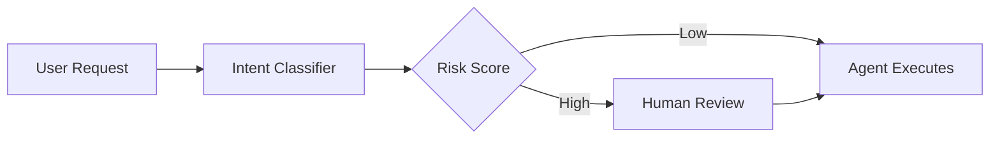

# 006 — Reveal.js Talk Presentations

> Status: `implementing`
> Mode: `prototype`
> Date: 2026-03-19

## Intent

Jean-Paul can author conference talks, meetup presentations, and tech deep-dives as Markdown files in his repo, and the site renders them as full Reveal.js slide decks at `/talks/[slug]`. Each talk also gets a card in the home page content grid (category: `talk`) linking to the live presentation. Slides are written using standard Markdown with `---` separators between slides, support code highlighting, Mermaid diagrams, and speaker notes — all themed to match the site's DA palette.

## Shared Schema

```typescript
// src/shared/schemas/site.schema.ts (modifications to spec 001)

// ContentCategory unchanged — "talk" already exists
export type ContentCategory = "blog" | "project" | "talk" | "short";

// New: Talk-specific frontmatter extensions
export interface TalkFrontmatter extends PostFrontmatter {
  category: "talk";

  /** Reveal.js configuration overrides per talk */
  reveal?: RevealConfig;

  /** Where and when this talk was given */
  event?: string;            // e.g. "KubeCon EU 2026"
  eventUrl?: string;         // Link to the event page
  eventDate?: string;        // ISO date of the presentation (may differ from post date)

  /** Optional link to video recording */
  videoUrl?: string;

  /** Optional link to external slides (Speakerdeck, Google Slides) — if set, no Reveal rendering */
  externalSlides?: string;
}

export interface RevealConfig {
  transition?: "none" | "fade" | "slide" | "convex" | "concave" | "zoom";
  autoSlide?: number;        // ms between auto-advance (0 = disabled)
  loop?: boolean;
  showNotes?: boolean;       // Show speaker notes in presentation view
  slideNumber?: boolean | string;  // e.g. true, "c/t", "h.v"
}

/**
 * Markdown authoring conventions for slides:
 *
 * ---                          → horizontal slide separator
 * ----                         → vertical slide separator (nested slides)
 * Note: speaker notes here     → speaker notes (after "Note:" on a slide)
 *
 * Standard Markdown features:
 * - # headings for slide titles
 * - ```lang code blocks with syntax highlighting
 * - ```mermaid blocks rendered as diagrams (spec 004 integration)
 * -  for images
 * - **bold**, *italic*, [links](url) as usual
 *
 * Reveal.js extensions:
 * - <!-- .slide: data-background="#1E1B4B" --> for per-slide backgrounds
 * - <!-- .element: class="fragment fade-up" --> for fragments/animations
 * - ```js [1-2|3|4] for stepped line highlighting
 */
```

## API Acceptance Criteria

- [ ] API-1: Posts with `category: "talk"` that do **not** have `externalSlides` set are rendered as Reveal.js presentations at `/talks/[slug]` (a new route, separate from `/posts/[slug]`).
- [ ] API-2: Talks with `externalSlides` set continue to use the existing behavior from spec 001 — the card links to the external URL and no Reveal rendering occurs.
- [ ] API-3: `getStaticPaths` generates paths for all non-draft, non-external talks. `getStaticProps` reads the Markdown body and passes it as raw content to the Reveal.js client component.
- [ ] API-4: The Markdown body uses `---` as horizontal slide separators and `----` as vertical slide separators, matching the standard Reveal.js Markdown conventions.
- [ ] API-5: Speaker notes are authored using the `Note:` keyword after slide content (Reveal.js convention). Notes are accessible via the speaker view (`S` key).
- [ ] API-6: Talk Markdown files live in the same `content/posts/` directory as all other content. The `category: "talk"` field combined with the absence of `externalSlides` triggers Reveal rendering.
- [ ] API-7: Each talk page includes proper `<title>`, OG meta tags, and a canonical URL. The `og:image` uses the talk's cover image (generated or manual, per spec 002).
- [ ] API-8: A talk detail "landing page" is also generated at `/posts/[slug]` with metadata (title, event, date, summary, video link) and a prominent "View Slides →" button linking to `/talks/[slug]`.

## UI Acceptance Criteria

- [ ] UI-1: **Presentation view** — `/talks/[slug]` renders a full-viewport Reveal.js presentation. No site nav, no footer — the entire page is the slide deck. A small, semi-transparent "Back to site" link sits in the top-left corner (fades out after 3 seconds, reappears on mouse movement).
- [ ] UI-2: **DA-themed slides** — the Reveal.js theme matches the site's DA palette:
  ```
  Background:      #0B0F19
  Heading color:   #E2E8F0 (slate-200)
  Body text:       #CBD5E1 (slate-300)
  Accent / links:  #7C3AED (violet-600)
  Code background: #111827 (gray-900)
  Code text:       #E2E8F0
  Font:            Inter or system sans for body, JetBrains Mono for code
  ```
- [ ] UI-3: **Code highlighting** — fenced code blocks use syntax highlighting (Reveal.js `highlight` plugin) with the same Shiki/Prism theme as blog posts. Stepped line highlights (`[1-2|3|4]`) are supported.
- [ ] UI-4: **Mermaid in slides** — ```` ```mermaid ```` blocks inside slides render as diagrams using the same DA-themed Mermaid config from spec 004. Diagrams are centered and scaled to fit the slide.
- [ ] UI-5: **Slide controls** — arrow keys, spacebar, and swipe (mobile) navigate slides. Slide number is shown in the bottom-right corner. Progress bar at the bottom in the accent color.
- [ ] UI-6: **Speaker notes** — pressing `S` opens the Reveal.js speaker view with notes, next slide preview, and timer.
- [ ] UI-7: **Home page card** — talks with Reveal slides show a "▶ Slides" badge on their grid card (next to the date). Clicking the card navigates to the landing page at `/posts/[slug]`, not directly to the presentation.
- [ ] UI-8: **Landing page** — the `/posts/[slug]` page for a talk shows:
  - Cover image (if present)
  - Title, event name + link, date
  - Summary / abstract text
  - "View Slides →" button (primary CTA, links to `/talks/[slug]`)
  - "Watch Recording →" button (if `videoUrl` is set, secondary CTA)
  - Tag chips
- [ ] UI-9: **Mobile** — slides are touch-navigable (swipe). Text scales down gracefully. The "Back to site" link is always visible on mobile (no fade-out).
- [ ] UI-10: **Fullscreen** — pressing `F` enters browser fullscreen mode (standard Reveal.js behavior).

## Integration Acceptance Criteria

- [ ] E2E-1: Adding a `.md` file with `category: "talk"` and slide content separated by `---` produces both a landing page at `/posts/[slug]` and a presentation at `/talks/[slug]`.
- [ ] E2E-2: The presentation is navigable with arrow keys and displays all slides in order, with correct syntax-highlighted code blocks.
- [ ] E2E-3: A talk with `externalSlides: "https://speakerdeck.com/..."` renders only the landing page with a link — no Reveal rendering, no `/talks/[slug]` route.
- [ ] E2E-4: A talk with `videoUrl` shows the "Watch Recording →" button on its landing page.
- [ ] E2E-5: Mermaid blocks inside slides render as themed diagrams.
- [ ] E2E-6: Speaker notes authored with `Note:` are visible in the speaker view (`S` key).
- [ ] E2E-7: The presentation page loads in < 3 seconds on a 3G connection (Reveal.js + Markdown plugin lazy-loaded).
- [ ] E2E-8: Building with `npm run build` generates all talk routes without errors. Talks with invalid Markdown degrade gracefully (render as a single slide with error message).

## Component States

| State | Condition | What the user sees |
|-------|-----------|-------------------|
| Empty | No talks with Reveal content | No `/talks/` routes generated. Talk cards with `externalSlides` still appear in grid. |
| Loading | Reveal.js initializing (client-side) | Dark background (`#0B0F19`) with a subtle centered loading spinner matching accent color. Loads in < 500ms typically. |
| Populated | Valid talk Markdown rendered | Full-viewport Reveal.js slide deck, DA-themed, interactive. |
| Landing | Visitor on `/posts/[slug]` for a talk | Metadata page with "View Slides →" CTA and optional video link. |
| Error | Invalid Markdown or Reveal init failure | Single slide with: "⚠ Presentation failed to load" + error message. "Back to site" link visible. |
| External | `externalSlides` is set | No Reveal rendering. Card links to external URL. Landing page has "View External Slides →" button. |

## Non-goals

- No slide builder or visual editor — Jean-Paul authors slides in Markdown in his editor.
- No PDF export from the site — use Reveal.js `?print-pdf` query param + browser print or DeckTape externally.
- No collaborative / live-audience features (polling, Q&A, multiplexing) in v1.
- No auto-advance or kiosk mode by default (available via `reveal.autoSlide` frontmatter override).
- No separate talk-specific cover generation style — talks use the same DA from spec 002.
- No embedded video playback in slides — link out to recordings.

## Edge Cases

| Scenario | Layer | Expected |
|----------|-------|----------|
| Talk has no `---` separators | Reveal | Entire content renders as a single slide. No error. |
| Talk has 100+ slides | Reveal | Reveal.js handles this natively. Navigation is fine. Consider a warning in build output if slide count > 50 (unusually long). |
| Slide contains a very large image | UI | Image scales to fit the slide viewport via `max-width: 100%; max-height: 70vh`. No overflow. |
| Slide contains a Mermaid block that fails to render | UI | Mermaid error is contained to that slide. Other slides unaffected. Error message shown inline. |
| Speaker notes contain Markdown formatting | Reveal | Notes are rendered as HTML in the speaker view (Reveal.js supports this natively). |
| Talk `category: "talk"` but no `externalSlides` and body is empty | Build | Generates a single blank slide. Build logs a warning. |
| User navigates directly to `/talks/[slug]` (no landing page first) | Routing | Presentation loads directly. "Back to site" link navigates to `/posts/[slug]` landing page. |
| Talk and blog post have the same slug | Build | Not possible — all content shares the same `content/posts/` namespace. Slugs are unique across categories (enforced by Zod at build time). |
| Reveal.js fails to load (CDN down, script blocked) | Client | Fallback: raw Markdown rendered as formatted text with a "Presentation could not load" banner. |

## Directory Structure (additions to spec 001)

```
├── app/
│   └── talks/
│       └── [slug]/
│           └── page.tsx        # NEW: Reveal.js presentation page
├── components/
│   ├── RevealPresentation.tsx  # NEW: client component (dynamic import, ssr: false)
│   └── TalkLanding.tsx         # NEW: talk metadata + CTA page section
├── lib/
│   └── reveal-theme.ts         # NEW: DA-compliant Reveal.js theme CSS variables
├── content/
│   └── posts/
│       └── my-kubecon-talk.md  # category: talk, slides separated by ---
```

## Example Talk Markdown

```markdown
---
title: "Securing Agentic Systems: Guardrails in Production"
slug: securing-agentic-systems
date: 2026-03-15
summary: "A deep dive into benchmarking frameworks and deployment patterns for autonomous agents."
tags: ["ai-safety", "agents", "guardrails"]
category: talk
event: "KubeCon EU 2026"
eventUrl: "https://events.linuxfoundation.org/kubecon-cloudnativecon-europe/"
eventDate: "2026-04-02"
videoUrl: ""
cover: ""
autocover: true
coverKeywords: ["agents", "guardrails", "kubernetes", "deploy"]
coverHint: "agents passing through guardrail checkpoints before reaching a kubernetes cluster"
---

# Securing Agentic Systems
### Guardrails in Production

Jean-Paul Iraguha · KubeCon EU 2026

Note: Welcome everyone. Today we'll talk about how to ship agents safely.

---

## The Problem

- Autonomous agents make decisions without human approval
- Unconstrained agents can take **destructive actions**
- Traditional RBAC doesn't account for *intent*

Note: Start with the why — why existing patterns break down.

---

## Benchmarking Framework

```python [1-3|5-7]
# Define evaluation suite
suite = AgentBenchmark(
    scenarios=load_scenarios("safety/"),

    guardrails=[
        InputValidator(),
        OutputFilter(policy="strict"),
    ],
)
```

Note: Walk through the code — highlight the guardrail injection point.

---

## Architecture



Note: This is the core flow. Emphasize the human-in-the-loop for high-risk.

----

### Risk Score Details

| Signal | Weight |
|--------|--------|
| Action scope | 0.3 |
| Data sensitivity | 0.4 |
| Reversibility | 0.3 |

Note: Vertical slide — drill into the scoring table for those interested.

---

## Key Takeaways

1. **Guardrails are not optional** — they're infrastructure
2. **Benchmark before you deploy** — not after
3. **Human-in-the-loop** for high-risk decisions

---

## Thank You

**Jean-Paul Iraguha**
@jeanpaul · iraguha.dev

Note: Leave contact info up. Open for questions.
```

## External Dependencies

- **`reveal.js`** — Presentation framework. Loaded client-side via dynamic import (`ssr: false`). Includes built-in plugins: Markdown, Highlight, Notes.
- **`reveal.js/plugin/markdown`** — Parses Markdown content into slide sections.
- **`reveal.js/plugin/highlight`** — Syntax highlighting for code blocks in slides.
- **`reveal.js/plugin/notes`** — Speaker notes panel.
- **`mermaid`** — Already in spec 004. Reused for ```` ```mermaid ```` blocks within slides.

## Open Questions

- [ ] Should `/talks/[slug]` be the URL, or embed the presentation at `/posts/[slug]/slides` to keep the URL namespace simpler?
- [ ] Worth adding a "slide count" indicator on the talk card (e.g. "23 slides")?
- [ ] Should the "Back to site" overlay include quick-access buttons (fullscreen, speaker view, print)?
- [ ] Is there value in generating a static HTML export of each talk (via `reveal-md --static`) for offline sharing or archival?

## Post-Implementation Notes

_Filled when status → complete. Not required for prototypes._

- ...
