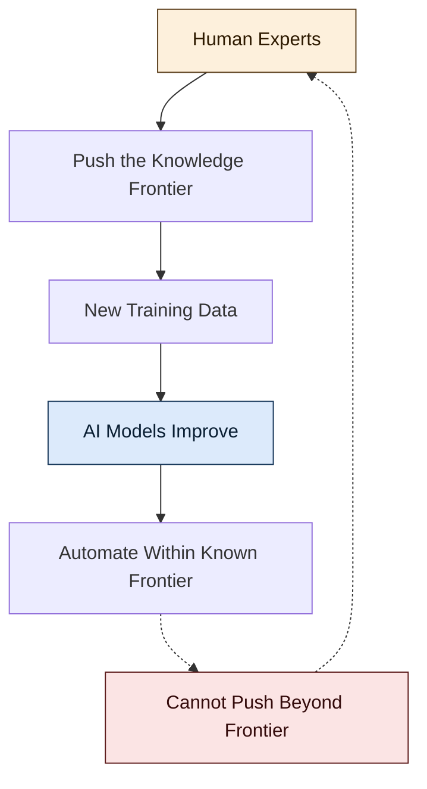
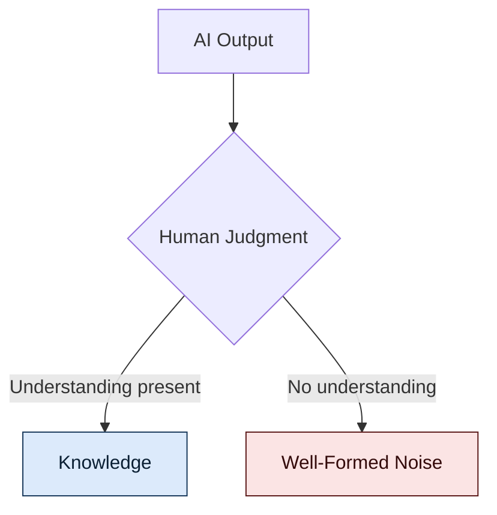

## The Karp Thesis

Palantir CEO Alex Karp recently argued that only two types of people will survive the AI economy: tradespeople and the neurodivergent. The framing is provocative by design — a credentialed insider (philosophy PhD, $433B company) telling the next generation that credentials are worthless.

The trades argument is clean. Electricians and plumbers operate in physical reality where automation hits hard limits. Data centres need bodies. That part holds.

The second half — "neurodivergent" as a survival category — does a lot of rhetorical work while saying very little. It is a trait-based proxy for something more precise, more learnable, and more important: **meta-thinking**.

## Meta-Thinking, Not Neurodivergence

The valuable capacity is not a neurological trait. It is the ability to articulate a chain of thought around a problem — to decompose, hold multiple abstraction levels, notice when a reasoning path has gone off the rails. This is a skill, not a birthright.

But meta-thinking without domain grounding is empty. The two are inseparable, not sequential. A physicist's intuition for which problems are tractable is not separate from their physics knowledge — it is compiled from it. Years of wrestling with the object-level produce the meta-layer. You cannot skip straight to orchestration.

This is why the framing matters. Karp gestures at the right phenomenon but smuggles in a trait that is neither actionable nor precise. The real scarcity is not in how your brain is wired. It is in whether you have done the deep work that makes judgment possible.

## The Training Data Is Human

Here is where the argument gets harder. Consider a thought experiment: if no more physicists graduate — anywhere, ever — AI physics research stops moving forward. No matter how capable the models become.

Current systems are downstream of human expertise. They compress, recombine, and synthesise what humans have already figured out. Remove the humans who push the frontier, and there is nothing new to compress. The models plateau at excellent synthesis of existing knowledge.

The chess analogy is useful. Knowing the rules of chess lets you play one move ahead. Decades of grandmaster intuition lets you see twenty. AI trained on grandmaster games is a very strong engine — but remove the grandmasters who produced the corpus and the engine does not keep improving on its own. AlphaZero-style self-play works because chess is a closed system with a crisp reward signal. Physics is not closed. Reality is the reward signal, and reading reality requires humans who have spent decades learning to ask it the right questions.

## The Chinese Room, Inverted

But the problem is more fundamental than a training data pipeline. Consider translation. You can ask an AI to translate a text into Chinese. Without someone who understands Chinese on the receiving end, that translation is empty of sense — it is not really Chinese. It is shapes that happen to be Chinese-shaped.

This is Searle's Chinese Room pushed further. Searle said the room manipulates symbols without understanding. The deeper point: **without someone who can judge the output, the output is not knowledge — it is well-formed noise**. Translation only becomes translation when it lands in a mind that can verify it preserves meaning. Otherwise it is a signal with no receiver.

Knowledge is not a static artifact that can be stored, retrieved, and deployed. It is constituted in the act of being understood. It exists in the interaction between a capable system and a judge who can tell whether the output is tracking reality. Remove the judge, and you cannot distinguish genuine insight from confident hallucination that happens to be syntactically well-formed.

The model cannot tell the difference. Only the understanding human can.

## The Validation Layer

This reframes what humans are in the AI era. They are not just "users" or "operators" or even "meta-thinkers." They are the **validation layer** that makes AI outputs meaningful at all.

A physics paper generated by AI is not physics until a physicist reads it and judges it against their model of reality. A code change is not correct until someone who understands the system confirms the specification captured what mattered. A medical diagnosis is not medicine until a clinician evaluates it against the patient in front of them.

Microsoft's Jaime Teevan argues that metacognitive skills — flexibility, critical thinking, the ability to challenge outputs — become more valuable in the AI era. She is right, but underselling it. It is not just that humans need to think about thinking. It is that humans are the condition under which AI outputs count as thinking at all.

## The Self-Undermining Prescription

This is why Karp's advice, taken literally, is self-undermining. If everyone follows the prescription — skip the humanities, skip theoretical physics, learn a trade or hope you were born different — you get a civilisation that can execute and automate brilliantly within the existing frame but cannot generate the next one. The AI systems built on top of that civilisation inherit the ceiling.

The real advice, inverted from Karp: **society desperately needs more people doing deep work in hard domains**, not fewer. They are the scarce input to everything downstream, including the AI systems themselves.

## The Uncomfortable Conclusion

A civilisation that successfully offloads judgment to AI does not become smarter. It becomes one that has lost the capacity to tell whether it is still thinking.

The interactive aspect of knowledge — the thing that sometimes takes the form of judgment, sometimes understanding, sometimes something harder to name — is not a feature we can automate away. It is the ground on which everything else stands. Remove it, and the entire system is playing chess one move at a time, knowing the rules but seeing nothing.
