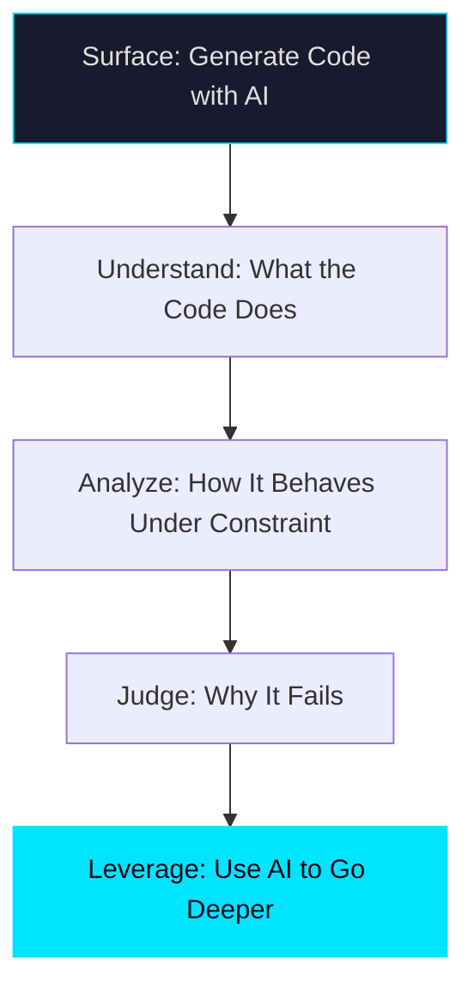

## Why Programming Languages Were Built in the First Place

Over the past several decades, we have collectively built thousands of programming languages — each one a response to a specific class of problem. It is tempting to describe their purpose as "telling machines what to do." But under the hood, something more fundamental is happening.

Programming languages exist to eliminate **ambiguity**. They encode invariants into a formal system: what types are permitted, what operations are legal, what states are unreachable. Syntax, type systems, and language design are not incidental details — they are the mechanisms through which we make ambiguity structurally impossible. This distinction matters more than it might seem at first glance.

## The Gap Between Generating Code and Understanding It

A common claim in our industry right now is that *"In a few years, anyone will be able to code."* In practice, what this usually means is: *"Anyone will be able to ask for software and get it."* These are not the same thing.

Let's walk through why. When we build production systems, we routinely encounter questions that code generation alone cannot answer:

1. **Behavioral correctness**: Does this program behave correctly under constraint — at scale, under load, at edge cases?
2. **Failure modes**: When it breaks, why does it break? Where do silent failures hide?
3. **Assumption validation**: What invariants does the code depend on, and are those invariants actually guaranteed by the systems upstream?

Generating a syntactically valid program is the easy part. Understanding what that program does — and more importantly, what it does not do — is where engineering judgment lives. The gap between generation and understanding is where failures hide.

## How Language Choice Shapes Engineering Thinking

Early in my career, I was productive using Python to solve differential equations. I got things done. But I was operating inside an ecosystem — a paradigm optimized for scientific computing and numerical data. Languages are designed for something specific. They encode a worldview.

When I later explored lower-level languages (Rust, C++, assembly), my understanding of the systems I had been building on top of changed significantly. I am not suggesting everyone must become a low-level engineer. However, the tradeoff of investing in lower-level understanding was worth it — it improved my effectiveness at every level of the stack:

- **Architectural judgment**: Understanding memory layout and allocation strategies makes you better at designing data pipelines, not just writing them.
- **Hidden cost awareness**: Abstractions have costs — garbage collection pauses, serialization overhead, network round-trips — and knowing where those costs live changes the decisions you make.
- **Constraint surface visibility**: When you understand what the hardware and runtime actually provide, you can reason about what is possible, not just what the framework exposes.

In practice, the engineers who build the most reliable systems are the ones who understand at least one layer below the one they operate on daily.

## Applying This Principle to AI-Assisted Development

The same pattern extends to the current era of AI-assisted development. Understanding model architectures, agent orchestration, compilation layers, hardware principles, and memory constraints does not make AI tools less powerful. It gives you **leverage** — the ability to use those tools more effectively because you understand the system they are operating within.

It may sound counterintuitive in an era where many will stop learning to code deeply. But I believe the most strategic investment right now is this: **strengthen your foundations as a developer** while using AI to go even deeper in your understanding. Not shallower.

## Summary

Abstraction without understanding creates dependence; understanding with abstraction creates leverage. The question was never "Can anyone code?" — it was always "Who understands what the code does?" As generating software becomes increasingly accessible, that understanding becomes the scarcest and most valuable capability we can build.
