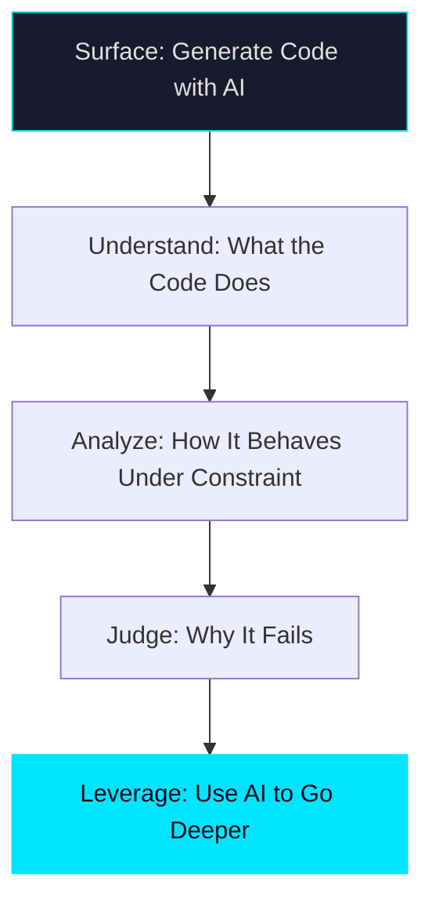

## The Real Reason Programming Languages Exist

There is a subtle and elegant boundary between **ambiguity** and **formal languages** that most people don't fully appreciate.

Programming languages were not invented merely to "tell machines what to do." They emerged as a response to ambiguity. Programming is not just expressing intent — it is encoding invariants into a formal system.

That's why syntax matters. That's why types matter. That's why language design matters. They encode assumptions about the world, restrict what is allowed to happen, and make ambiguity illegal.

## The Conflation

So when people say *"In a few years, anyone will be able to code"* — that is misleading.

What they often mean is: *"Anyone will be able to ask for software and get it."*

That is not the same thing.

Very few people may actually understand what the program does, how it behaves under constraint, or why it fails. And here lies the real problem: if almost no one understands the underlying infrastructure, how do we remain critical of the output? How do we challenge assumptions? How do we question correctness? How do we detect silent failures?

> Generating code is not the same as understanding code. The gap between the two is where failures hide.

## Languages Shape Thinking

In my early junior days, I was productive using Python to solve differential equations. I got things done. But I was operating inside an ecosystem — a paradigm optimized for scientific computing and data.

Languages are designed *for something*. They encode a worldview.

If I had never explored lower-level languages like Rust, C++, or assembly, my thinking would have been shaped — and sometimes narrowed — by the abstractions I relied on. I am not saying everyone must become a low-level engineer. But understanding lower-level mechanics makes you better at any level:

- It sharpens **architectural judgment**
- It exposes **hidden costs**
- It reveals **constraint surfaces**
- It makes abstractions **visible** instead of magical

## The Same Applies to Vibe Coding

The same principle extends to the AI-assisted development era. Understanding model architectures, agents, compilation layers, hardware principles, and memory constraints does not make AI less powerful.

It gives you **leverage**.

It may sound counterintuitive in an era where many will stop learning to code deeply. But perhaps the most courageous and strategic choice today is this: **strengthen your foundations as a developer** while using AI to go even deeper in your understanding. Not shallower.

## The Takeaway

Abstraction without understanding creates dependence. Understanding with abstraction creates power.

The question was never *"Can anyone code?"* — it was always *"Who understands what the code does?"* In a world where generating software becomes trivial, that understanding becomes the scarcest and most valuable thing you can build.
