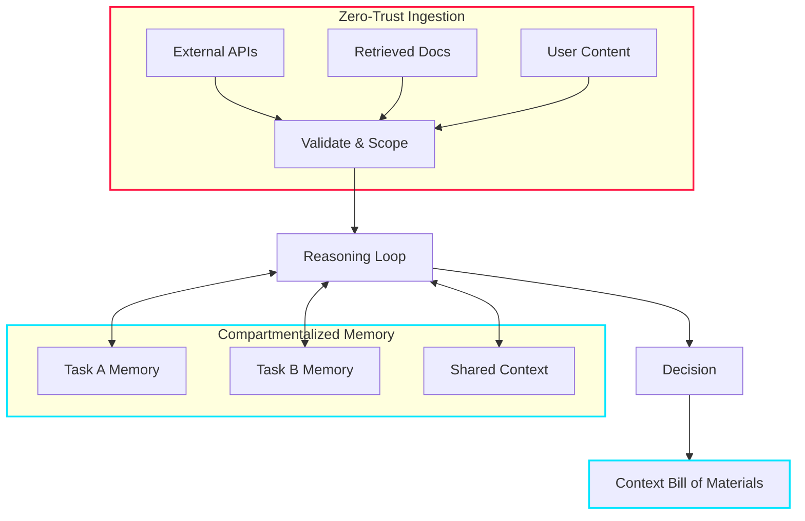

## The Problem: Agent Security Beyond Prompt Injection

Most AI safety conversations today focus on alignment, prompt injection, or output filtering. These are important concerns — but they address only the surface layer of a much deeper problem. What about the architecture of autonomy itself — how agents ingest information, structure their memory, and reason over time?

I have been thinking about this question for a while, and Ken Huang's article [*Context Engineering as the New Security Firewall*](https://kenhuangus.substack.com/p/context-engineering-as-the-new-security) crystallized several ideas I had been circling around. It explores emerging security challenges in AI systems and proposes concrete structural approaches to mitigate them. Three ideas stood out to me — not because they are theoretically novel, but because they map directly onto patterns I recognize from building distributed systems.

## Zero-Trust Ingestion: Treating Every Input as Potentially Adversarial

In traditional software architecture, we learned the hard way that trusting external inputs leads to vulnerabilities — SQL injection, XSS, deserialization attacks. The mitigation pattern is well-established: validate at the boundary, never trust upstream data implicitly.

The same principle applies to AI agents, but the attack surface is different. External inputs to an agent — retrieved documents, API responses, user-provided content — do not just carry data. They carry *context* that directly shapes the agent's reasoning. A carefully crafted document in a RAG pipeline can steer an agent's behavior just as effectively as a prompt injection, but far more subtly.

**Zero-trust ingestion** means assuming every piece of context could be adversarial. In practice, this translates to several concrete mechanisms:

1. **Validation**: Each input is checked for structural integrity and conformance to expected schemas before it enters the reasoning loop.
2. **Scoping**: Inputs are tagged with provenance metadata — where they came from, when they were retrieved, and what trust level they carry.
3. **Containment**: Rather than filtering problematic content after the fact, the system constrains how each input can influence downstream reasoning from the start.

This is the same principle behind zero-trust networking, applied to cognition. The perimeter is not the network boundary — it is the boundary between external data and the agent's reasoning process.

## Memory Compartmentalization: Process Isolation for Agent Cognition

Long-lived memory is one of the most powerful capabilities an agent can have — and one of the most dangerous. Memory is not passive storage. It directly shapes how an agent interprets future inputs, weighs evidence, and selects actions. If I do not explicitly govern what gets stored, updated, and reused, **subtle corruption can accumulate over time** in ways that are extremely difficult to detect.

Let's walk through a concrete scenario. Imagine an agent that assists with code reviews across multiple repositories. If its memory is a single shared pool, a poisoned context from one repository — say, a malicious comment that embeds instructions — could influence how the agent reviews code in a completely unrelated project weeks later. The agent has no mechanism to distinguish between trusted architectural knowledge and injected garbage; it treats all memory as equally valid context.

**Memory compartmentalization** addresses this by isolating memory segments along task, domain, or trust boundaries. The benefits are analogous to process isolation in operating systems:

- **Blast radius reduction**: A compromised memory segment affects only the tasks that read from it, not the agent's entire reasoning chain.
- **Cross-contamination prevention**: Task-specific memory stays scoped to its task. Shared context — the things the agent should remember across tasks — lives in a separate, more carefully governed layer.
- **Garbage collection**: Compartmentalized memory is easier to audit, expire, and purge. When a task completes, its memory segment can be discarded without worrying about side effects on unrelated contexts.

In practice, this is similar to how we design microservice data isolation — each service owns its data, and cross-service communication happens through explicit, validated contracts rather than a shared database.

## CxBOM: A Context Bill of Materials for Agent Decisions

One of the most compelling ideas in the article — and the one I keep returning to — is treating context as a traceable artifact. In software supply chains, we rely on **SBOMs** (Software Bill of Materials) to track which libraries, versions, and dependencies were used to build a particular binary. When a vulnerability is discovered, the SBOM lets you trace which builds are affected.

Agents need something analogous: a **Context Bill of Materials (CxBOM)** — a structured record of which inputs, tools, memory segments, and retrieval results influenced a specific decision. This introduces traceability into agent reasoning. Not only *what* was produced, but *what influenced it*.

The value becomes concrete when something goes wrong. When an agent makes a questionable decision — approving a risky deployment, generating incorrect analysis, or taking an unexpected action — the CxBOM lets you audit the full context lineage instead of guessing. You can answer questions like:

- Which retrieved documents were in the context window at decision time?
- Was the agent drawing on stale memory from a previous, unrelated task?
- Did a specific tool call return unexpected data that shifted the reasoning?

Without this traceability, debugging agent behavior is like debugging a distributed system without logs — theoretically possible, but practically hopeless at scale.

## Why This Matters: Agents Are Distributed Systems, Not APIs

The key insight — and the reason I think this framing is important — is that agent security is not only about sandboxing tools or restricting network access. It is about **structuring cognition** and defining trust boundaries before execution begins.

As agents gain persistent memory, tool access, and multi-step autonomy, their behavior increasingly resembles distributed systems rather than simple request-response APIs. They maintain state across interactions. They make decisions based on accumulated context. They interact with external services that return data of varying trustworthiness. Their security model must evolve accordingly:

- **Explicit trust boundaries** at every ingestion point — no input enters the reasoning loop without validation and provenance tagging.
- **Isolated memory layers** to contain blast radius — compartmentalized by task, domain, or trust level.
- **Context traceability** via CxBOM for auditability — every decision carries a manifest of what influenced it.
- **Controlled ingestion pipelines** that validate before reasoning — not filters that clean up after the fact.

The tradeoff of building these layers is additional complexity in the agent's infrastructure. However, I believe the investment is worth it — the alternative is agents that are powerful but structurally fragile, where a single corrupted input can cascade through memory and reasoning in ways no one can trace.

## Summary

This article pushes the conversation toward designing agents that are not just capable, but **structurally robust**. If you are building agents with persistent memory, tool use, or multi-step planning, the security perimeter is not the network — it is the context window.

The patterns are not new. Zero-trust networking, process isolation, supply chain traceability — these are established ideas from systems engineering. What is new is applying them to the cognitive architecture of autonomous agents. I think that mapping is both natural and overdue.

Worth reading the [full piece](https://kenhuangus.substack.com/p/context-engineering-as-the-new-security) if you are thinking about zero-trust ingestion and memory isolation in your own architectures.
