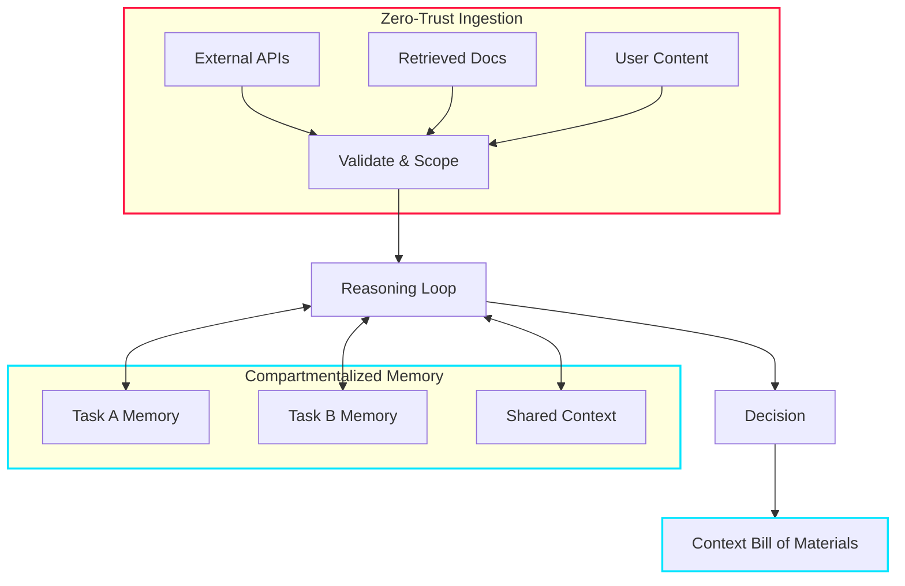

Most AI safety conversations focus on alignment, prompt injection, or output filtering. But what about the architecture of autonomy itself — how agents ingest information, structure memory, and reason over time?

Ken Huang's article [*Context Engineering as the New Security Firewall*](https://kenhuangus.substack.com/p/context-engineering-as-the-new-security) shifts the discussion to exactly that. It explores emerging security challenges in AI systems and proposes concrete structural approaches to mitigate them. Three ideas stood out.

## Zero-Trust Ingestion

External inputs — retrieved documents, APIs, user content — should never be implicitly trusted. Instead of filtering after the fact, this mindset assumes every piece of context could be adversarial. Security becomes a matter of **containment and controlled interpretation** from the start, not a post-hoc cleanup.

This is the same principle behind zero-trust networking, applied to cognition. Every input gets validated, scoped, and tagged before it touches the reasoning loop.

## Memory Compartmentalization

Long-lived memory is powerful — and risky. Memory is not passive storage. It directly shapes how an agent interprets future inputs. If we don't explicitly govern what gets stored, updated, and reused, **subtle corruption can accumulate over time**.

Compartmentalizing memory reduces the blast radius and limits cross-contamination between tasks. Think of it as process isolation for agent cognition: one compromised memory segment shouldn't poison the entire reasoning chain.

## CxBOM: Context Bill of Materials

One of the most compelling ideas is treating context as a traceable artifact. Just as software supply chains rely on **SBOMs** (Software Bill of Materials), agents may require a **Context Bill of Materials** — a structured record of which inputs, tools, and memory segments influenced a decision.

This introduces traceability into agent reasoning. Not only *what* was produced, but *what influenced it*. When an agent makes a questionable decision, you can audit the full context lineage instead of guessing.

## The Bigger Picture

The key insight is that agent security is not only about sandboxing tools or restricting network access. It's about **structuring cognition** and defining trust boundaries before execution begins.

As agents gain memory, tool access, and multi-step autonomy, their behavior increasingly resembles distributed systems rather than simple APIs. Their security model must evolve accordingly:

- **Explicit trust boundaries** at every ingestion point
- **Isolated memory layers** to contain blast radius
- **Context traceability** via CxBOM for auditability
- **Controlled ingestion pipelines** that validate before reasoning

> Autonomy without architectural discipline creates invisible fragility.

## Takeaway

This article pushes the conversation toward designing agents that are not just powerful, but **structurally robust**. If you're building agents with persistent memory, tool use, or multi-step planning, the security perimeter isn't the network — it's the context window.

Worth reading the [full piece](https://kenhuangus.substack.com/p/context-engineering-as-the-new-security) if you're thinking about zero-trust ingestion and memory isolation in your architectures.
