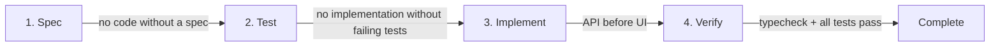
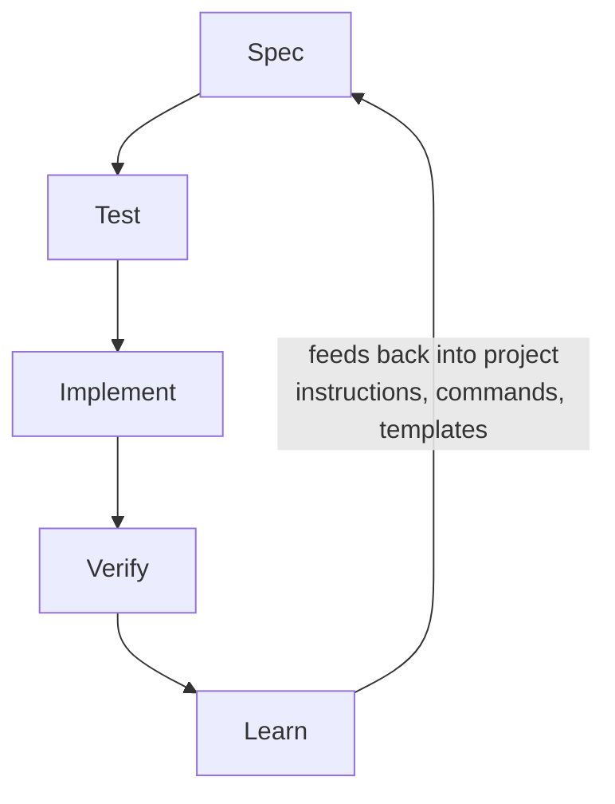

## Where the serious conversation actually is

The spec-driven development conversation has split into two camps. One camp sells the dream: write a spec, hand it to an agent, ship the output. The other camp — the practitioners who have actually shipped production systems this way — tells a more nuanced story.

The most careful empirical examination of SDD tools defined a taxonomy that the industry now references: **spec-first** (spec written then used as input), **spec-anchored** (spec kept alive and evolved alongside the code), and **spec-as-source** (spec is the main artifact, human never touches code). The hands-on verdict is cautionary. Even with all the files, templates, prompts, and workflows, agents frequently do not follow instructions. Just because context windows are larger does not mean the agent will properly pick up on everything in them. Agents ignore research notes about existing classes and regenerate duplicates — and also go overboard by too eagerly following instructions.

The most important counterweight to the hype is the observation that the assumption you will not learn anything during implementation that changes the spec is "bizarre" — a story the industry has heard for decades: "if only we could get the specification right, the rest would be easy." What serious practitioners do endorse is **TDD as the strongest form of prompt engineering.** One practitioner built a 13,000-line production system using a coding agent with red-green-refactor, and the argument holds: TDD served a critical function because it kept the developer in the loop. You cannot write a meaningful test for something you do not understand.

The professional alternative to vibe coding is being framed as **agentic engineering** — engineers using coding agents to amplify their existing expertise. The "Dark Factory" experiment (fully autonomous spec-to-binary, no human code review) is a fascinating but flawed frontier — $1,000/engineer/day token costs and tangled spaghetti code revealing the gap between "it compiles" and "it is good."

The question that sits underneath all of this: **where do humans sit relative to the loops?** Some interpretations of SDD are much the same as vibe coding — humans invest effort in writing the outcome they want, but do not dictate how the agent achieves it. The better proposal: humans should be "on the loop" — building and managing the working loop rather than either leaving agents to it or micromanaging every output.

And the triangle model surfaced a practical truth the first wave missed: **tests and specs are not free.** The first successful SDD projects all had large existing test suites to lean on. That was the low-hanging fruit. As complexity grows, structural choices become more important — one team's C compiler got to 1% failing tests, but every bug fix broke something else because systemic changes required systemic thinking, not local patches.

These are the constraints I tried to internalize when I built my own SDD workflow. The entire system — specs, commands, templates, project instructions, learnings — is open and available at [github.com/jiraguha/my-personal-website](https://github.com/jiraguha/my-personal-website). Here is what it looks like after 15 specs.

## Curating the stack for short feedback loops

Before writing a single spec, there is a decision that most SDD discussions skip: **choosing a stack that makes the feedback loop as short and clean as possible.** The stack is not a neutral background choice. It determines how fast tests run, how quickly the agent gets a signal, and how much review overhead each cycle carries.

A compelling example is Lovable. They deliberately chose React + Vite + Supabase — not because it is the best stack in the abstract, but because it gives their AI agent the shortest path from prompt to working application. No separate server to generate. The frontend connects directly to Supabase, which provides the database, authentication, and storage layer. The tradeoff is real — complex backend logic requires Edge Functions or exporting the code — but for their use case, the tradeoff is worth it. The stack is curated for the agent, not just the developer.

The same principle applies to any SDD workflow. For a full-stack TypeScript project, that might mean a runtime with sub-second test startup, a test runner with watch mode that re-runs only affected tests, and external services on localhost via Docker Compose — no mocks at the service boundary, no abstractions over infrastructure. For a Python data pipeline, it might be `pytest` + `httpx`. For a Rust CLI, `cargo test` with its built-in harness. **The tools change for every project. The principle does not: shortest feedback loop, cleanest eval, lowest review overhead.** An agent that runs tests after every code change needs those tests to execute fast and return clear signals. If the test suite takes four minutes to start, it does not matter how good the spec is.

## The four-phase workflow

Every feature moves through four phases. Each phase is gated — you cannot skip ahead.



**Phase 1 — Spec.** An interactive session that produces a numbered Markdown file (`specs/NNN-feature.md`). The spec defines intent in one paragraph, shared schemas that both sides of the application must conform to, acceptance criteria split by layer (API, UI, E2E), component states, edge cases, and non-goals. The template is strict — every section must be addressed before the spec moves to `approved`.

This is the part where the critique matters most. The spec is not a waterfall document that tries to predict everything. It is a contract — "here is what I know right now, here are the acceptance criteria I am willing to commit to." The spec will often change as I learn more during implementation. The difference from old-school waterfall: the spec is short (one file, not fifty pages), the iteration is fast (minutes, not months), and the feedback mechanism is automated tests, not a change review board.

**Phase 2 — Test.** Failing tests derived from each acceptance criterion in the spec. If the spec says "the API returns a 404 when the resource does not exist," there is a test for that before any handler code exists. This phase will not run unless the spec status is `approved`.

This is where the "strongest form of prompt engineering" thesis comes alive. Writing a failing test forces me to articulate what the system should do in a form the machine can verify. It is a spec that runs. And the test exists before the agent writes any code — so the agent has a clear target, and I have a clear signal for whether the output is correct.

**Phase 3 — Implement.** API first, then UI. Shared schemas are the bridge — the same validation logic runs on both sides. The agent generates implementation candidates; the tests verify them. If tests fail, the agent iterates. If the agent's approach is structurally wrong, I intervene — the "on the loop" position in practice.

**Phase 4 — Verify.** Type checker passes. Full test suite passes. The spec status moves to `complete` and becomes immutable. No one edits a completed spec — it is the historical record of what was built and why.

The gate rules are what makes this workflow different from "just write a spec and hope." The agent cannot skip from spec to implementation because the gates enforce the sequence. The human stays in the loop not because of discipline or good intentions, but because the system will not let the agent proceed without passing through the checkpoints.

## Prototype mode: because specs are not free

The triangle model is right — tests and specs are not free. Rigid spec-first development has a failure mode: it discourages exploration. If every experiment requires a spec, acceptance criteria, and failing tests before you write a line of code, you stop trying things. The cost of an idea becomes too high.

Prototype mode is the escape hatch. Skip the tests, skip the verification, go straight to implementation. You can optionally write a spec (marked with status `prototype`), or just describe what you want to build. The only rule: **prototype code gets promoted or deleted. It never stays as-is in production.**

The promotion path is explicit: take the prototype, write a proper spec, derive failing tests from acceptance criteria, re-implement through the full workflow, verify. The prototype code can be thrown away entirely — only the learning survives into the spec.

This addresses the core objection directly. The assumption that you will not learn anything during implementation is bizarre — so do not make that assumption. Use prototype mode to learn, then lock the learning into a spec and tests when you know what you are building. Not every idea deserves a spec on day one. But every idea that goes to production does.

## Context engineering: the environment is the system

One team published their experience building a 1M+ line product with zero manually typed code. Analysis of their approach notes that their harness combined context engineering, architectural constraints monitored by both LLM agents and deterministic linters, and "garbage collection" agents that run periodically to find inconsistencies. Their summary: **"Our most difficult challenges now center on designing environments, feedback loops, and control systems."**

This matches my experience at a smaller scale. The spec is one input to the agent. The environment that surrounds the spec is the system that determines whether the agent stays on track.

In practice, this environment has layers:

- **Project instructions** — A file that the agent reads at the start of every session. It defines the workflow, the gate rules, code conventions, anti-patterns, and project structure. Not a suggestion — a constraint. Every time the agent starts, it knows the rules.
- **Encoded commands** — Each phase of the workflow is a command file that the agent executes. The agent does not need to remember the process; the commands enforce it. A gated workflow with checkpoints — but encoded as executable steps rather than documentation the agent might ignore.
- **Deterministic guardrails** — Linters, type checkers, and CI pipelines that catch drift regardless of what the agent produces. These are not AI-powered. They are rule-based, fast, and absolute. Even when the agent drifts, the guardrails catch it.

The serious practitioners all point toward the same conclusion: the hard part is not writing the spec. It is building the environment that keeps agents from drifting. Context engineering is the real skill of SDD — and it is a skill that compounds over time as you learn what works and what does not.

## The self-improving loop

Most SDD discussions describe a cycle: spec, test, implement, verify. That cycle is necessary but incomplete. It misses the part where **the workflow itself gets better.**

After every session with the agent, I can document what went wrong — structured as context, error, root cause, fix, and consequences. Each learning is one problem per file. When a learning affects the workflow or conventions, it feeds back into the project instructions that the agent reads on the next session.



The agent does not get smarter through fine-tuning. It gets smarter because the context it reads improves with every iteration. Each bug discovered, each workflow friction identified, each convention clarified makes the next session more productive than the last. After 15 specs, the project instructions and command set reflect dozens of corrections that prevent the agent from repeating mistakes it made in earlier sessions.

This is the compounding effect that most SDD workflows miss. The first-wave SDD projects succeeded partly because they had large existing test suites to lean on. The learning loop is how you build that foundation from scratch — each cycle leaves behind not just working code and passing tests, but better context for the next cycle.

## From solo workflow to team delivery

The same principles apply at team scale, though the mechanisms change.

**Write specs first, derive tests from specs, let the tests be the quality gate.** This one shift touches four problem areas at once: quality (tests catch bugs before production), collaboration (specs are readable by everyone — not just the code author), technical debt (specs prevent shortcuts because acceptance criteria are explicit), and delivery speed (AI can generate code from specs, multiplying engineer output).

At a high level, a team rollout has two phases:

**Phase 1 — Quick wins (weeks 1–4).** Start with AI-assisted code review on every pull request — instant, zero overhead, catches the obvious problems. Add deterministic CI gates (lint, type check, run existing tests). Establish a firefighter rotation where one developer per week absorbs all bugs and incidents so the rest can focus on feature work. These changes produce results immediately and build trust in automated quality gates.

**Phase 2 — Full SDD (weeks 5–12).** Introduce the spec-driven workflow for new features. Every feature ticket becomes a spec: intent, acceptance criteria, schemas, edge cases. Failing tests are written before implementation. AI agents generate implementation candidates; the tests verify them. Engineers spend their time on specs and evals — the highest-leverage work — while AI handles implementation and machines handle verification.

The spec factory accelerates this further. Reusable spec templates for common patterns (CRUD endpoints, search filters, notification systems) mean domain experts capture the pattern once, and engineers instantiate it in minutes instead of hours. The template carries pre-filled acceptance criteria and standard edge cases — half the spec is written before the engineer starts.

A queryable knowledge base — incident postmortems, architecture decisions, domain knowledge from recorded walkthroughs — replaces tribal knowledge with searchable context. Every developer queries it on demand from their IDE. The learning loop from the solo workflow becomes a team habit: every incident and every friction point feeds into the shared context that every team member and every agent reads.

## What I have learned so far

After 15 specs — some through the full workflow, some through prototype mode and promoted later — a few things are clear.

**TDD is the strongest form of prompt engineering.** This is not a metaphor. Writing a failing test before the agent writes code is the single most effective way to keep the human in the loop. The test is a spec that runs, a contract that the machine can verify, and a signal that tells you whether the agent's output is correct. Everything else — the spec format, the template structure, the command encoding — supports this core mechanism.

**Context engineering compounds.** The first spec was slow. The fifteenth was fast — not because I got better at writing specs, but because the project instructions, the commands, and the conventions had accumulated 14 specs worth of corrections and refinements. The environment got smarter.

**Prototype mode is not a shortcut — it is essential.** The learning loop of experimentation is essential. Rigid spec-first without an escape hatch kills exploration. The deal is simple: explore freely, but promote or delete. Prototype code that lingers is technical debt with no spec to explain it.

**Agents drift — and that is manageable.** Agents do not always follow instructions, and larger context windows do not guarantee better adherence. But drift is not a fatal flaw. It is an engineering problem. Deterministic guardrails catch the easy drift. Failing tests catch the semantic drift. The learning loop captures the patterns of drift so you can prevent them in the next session.

**The end state is not "AI writes all the code."** It is engineers spending their time on the highest-leverage work — defining what to build (specs), defining what correct means (tests), and improving the environment that keeps the system honest (context engineering). The code is the implementation detail. The spec, the tests, and the context are the product.

## Try it yourself: bootstrapping a different project

The workflow described in this post is not tied to a specific stack or domain. To show that, here is how you would set it up for a completely different project — say, a Python CLI tool that monitors Kubernetes pod health and alerts on anomalies.

**1. Curate the stack for your feedback loop.**

The problem is a CLI that talks to the Kubernetes API, processes metrics, and sends alerts. The shortest feedback loop here is `pytest` with `click.testing.CliRunner` for CLI invocation tests, `responses` or `respx` for mocking HTTP calls to the K8s API, and a local Redis via Docker Compose for alert deduplication state. No cluster needed for the test suite — the K8s API responses are recorded fixtures.

```
pyproject.toml
CLAUDE.md
specs/
  TEMPLATE.md
src/
  k8s_monitor/
    cli.py
    collector.py
    alerter.py
    schemas.py          # Pydantic — the contract
tests/
  test_collector.py
  test_alerter.py
  test_cli.py
infra/
  docker-compose.yml    # Redis on localhost:6379
```

**2. Write `CLAUDE.md` — the project instructions.**

Define the two modes (full and prototype), the gate rules, the code conventions (`pydantic` at system boundaries, `typing` everywhere, no `Any`), and the anti-patterns. This file is the context the agent reads on every session. Adapt the conventions to Python idioms — `snake_case`, `import` over dynamic imports, `dataclasses` or `pydantic` for structured data.

**3. Create your spec template.**

Same structure as any SDD project — intent, shared schemas (Pydantic models instead of Zod), acceptance criteria split by layer (CLI, collector, alerter), edge cases, non-goals. The template enforces completeness.

**4. Run the workflow.**

`/spec-create` → define the first feature (e.g., "collect pod CPU metrics and alert when p95 exceeds threshold"). `/spec-test` → write failing `pytest` tests from acceptance criteria. `/spec-implement` → agent generates the implementation; tests verify it. `/spec-verify` → `mypy` passes, all tests pass, spec is complete.

**5. Start the learning loop.**

After the first session, document what the agent got wrong. Did it ignore the Pydantic schema and use raw dicts? Add that to `CLAUDE.md`: "always use Pydantic models at system boundaries, never raw dicts." Did it mock the Redis client instead of hitting the real one in Docker? Add that too. Each learning makes the next session better.

The repo at [github.com/jiraguha/my-personal-website](https://github.com/jiraguha/my-personal-website) is a concrete, working example of this workflow on a TypeScript web project. The `CLAUDE.md`, `specs/TEMPLATE.md`, and `.claude/commands/` directory are the pieces you would adapt to your own stack and domain. The workflow is the constant; the tools are the variable.

## Source material

The ideas in this post are informed by these pieces — each worth reading in full:

- [Martin Fowler — On Spec-Driven Development](https://martinfowler.com/fragments/2026-01-08.html) — The counterweight to the SDD hype: the learning loop of experimentation is essential, and TDD is the strongest form of prompt engineering.
- [Birgitta Böckeler — SDD Tools (Part 3)](https://martinfowler.com/articles/exploring-gen-ai/sdd-3-tools.html) — The most careful empirical evaluation of SDD tooling. Defines the spec-first / spec-anchored / spec-as-source taxonomy.
- [Birgitta Böckeler — Harness Engineering](https://martinfowler.com/articles/exploring-gen-ai/harness-engineering.html) — Analysis of building large-scale products with zero manually typed code: context engineering, deterministic linters, and garbage collection agents.
- [Kief Morris — Humans and Agents](https://martinfowler.com/articles/exploring-gen-ai/humans-and-agents.html) — Where humans sit relative to the loops: "on the loop" rather than in it or out of it.
- [Simon Willison — Agentic Engineering Patterns](https://simonw.substack.com/p/agentic-engineering-patterns) — The professional alternative to vibe coding. Test-first as the natural fit for coding agents.
- [Drew Breunig — The Rise of Spec-Driven Development](https://www.dbreunig.com/2026/02/06/the-rise-of-spec-driven-development.html) — The triangle model: specs, tests, and structural choices as complexity grows.
- [Drew Breunig — The SDD Triangle](https://www.dbreunig.com/2026/03/04/the-spec-driven-development-triangle.html) — Why systemic changes require systemic thinking, not local patches.
- [Addy Osmani — Writing Good Specs](https://addyosmani.com/blog/good-spec/) — Practical spec writing: gated workflows, checkpoints, and subagents with isolated context windows.
- [Lovable — Tech Stack & Exports](https://lovable.dev/faq/capabilities/tech-stack) — Why Lovable chose React + Vite + Supabase: a stack curated for the agent's feedback loop, not just the developer's preference.
