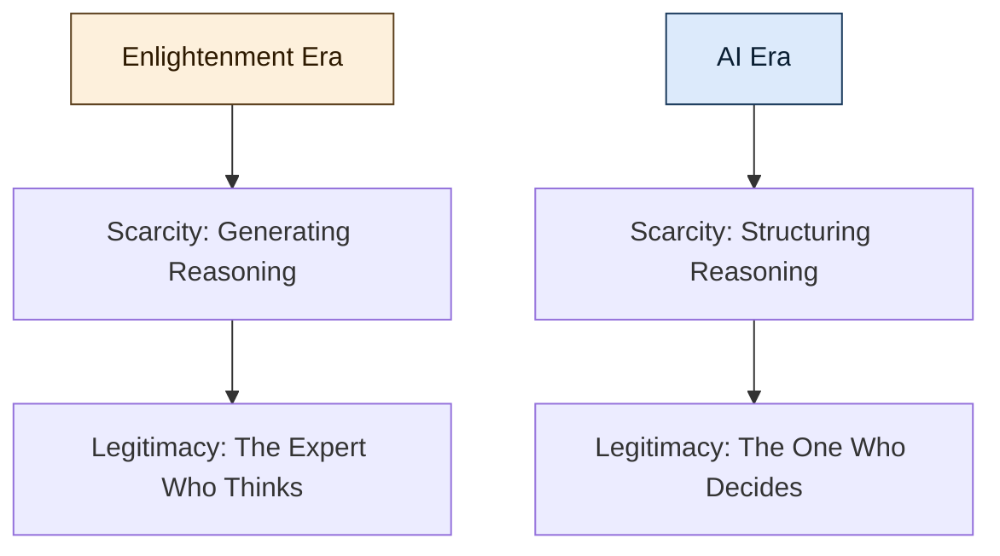

Over the past two years, the debate around AI has fixated on labour and productivity – who gets replaced, what gets faster, which jobs survive. The deeper question sits elsewhere, and it is harder to dismiss: the faculty that modern institutions were built around – structured reasoning – is becoming something anyone can summon on demand.

That shift is quieter than the headlines, and probably more consequential. In this article – stepping back from the tooling discourse – we explore what happens to the modern bargain when reasoning stops being scarce.

Today, we cover:

1. **The Enlightenment bargain.** Why thinking became the basis of legitimacy, and how that produced the institutions we still live inside.
2. **The destabilising moment.** What AI seems to touch that previous waves of automation did not.
3. **The migration of legitimacy.** Where scarcity – and with it, authority – appears to be moving.
4. **The next social contract.** A tentative read on what replaces "thinking makes you legitimate".

## The Enlightenment bargain

Modern society was built on a slow shift in legitimacy. Across the eighteenth century, with *Les Lumières*, power moved away from lineage, tradition and divine authority toward something else – **reason**.

> *Cogito ergo sum.* — I think, therefore I am.

Thinking was not just a faculty. It became the foundation of identity and authority. The one who could reason, demonstrate coherence and master abstraction earned legitimacy. From this emerged the modern social contract: education produced expertise, expertise produced authority, and authority structured institutions.

**Professions became custodians of scarce reasoning.** Law, medicine, engineering, economics – these were not merely jobs. They held systems complex enough to shape society, and years of study were the price of admission. The asymmetry was accepted because reasoning was hard to acquire. Differentiation stabilised hierarchy, and hierarchy stabilised the world.

In general, the bargain held because the bottleneck held. As long as generating structured thought was costly, the people who could do it commanded trust by default.

## The destabilising moment

This is why the present moment feels destabilising. Not because AI replaces labour. Not because it accelerates productivity. But because it touches the Enlightenment premise itself.

**AI seems to industrialise reasoning.** It does not abolish thinking – it scales it. Pattern production becomes accessible, composable, purchasable. Drafts can be generated. Code can be written. Contracts can be structured. Explanations can be synthesised. The boundary between *technical* and *non-technical* starts to blur in ways previous waves of automation never quite managed.

Playing devil's advocate, one could point out that earlier technologies also lowered barriers – calculators, search engines, spreadsheets – and the professions absorbed them without too much disruption. And of course, much of what current models produce is shallow, brittle or wrong. But those tools amplified specific tasks downstream of expertise. This one targets the act of generating structured thought itself, which sits closer to the source.

For centuries, differentiation rested on the ability to produce reasoning within a domain. Now that production is partially automated. And when production becomes abundant, scarcity tends to move somewhere else.

## The migration of legitimacy

This creates a tension. If thinking is no longer rare, what anchors legitimacy? If reasoning can be invoked on demand, what distinguishes expertise from orchestration?

The Enlightenment linked identity to cognition. In a world where cognition can be amplified and externalised, differentiation probably migrates upward – from *producing* reasoning to *structuring* it.

**The new scarcity sits one level up.** Not in writing the argument, but in defining the question. Not in drafting the system, but in designing its invariants. Not in generating options, but in judging coherence. Not in producing output, but in absorbing the consequences when the output is wrong.

Even so, the lower layer will still matter when judgment without craft becomes hollow – you cannot orchestrate what you do not understand. In general, the people who hold both seem best placed: enough fluency to read what the machine produced, enough framing to decide what it should have produced instead.

## The next social contract

We are probably not witnessing the end of differentiation. We are witnessing its **relocation**.

The Enlightenment said: *thinking makes you legitimate.*
The AI era suggests: *responsibility makes you legitimate.*

This is the tension beneath the surface debates – not a battle between humans and machines, nor between technical and non-technical identities, but a quiet reconfiguration of what society rewards and recognises as authority.

If reasoning becomes infrastructure, then structure becomes power. That shift – measured, uneven, far from settled – may be what redefines the next social contract. Your mileage will vary by domain, and the timeline is anyone's guess.
