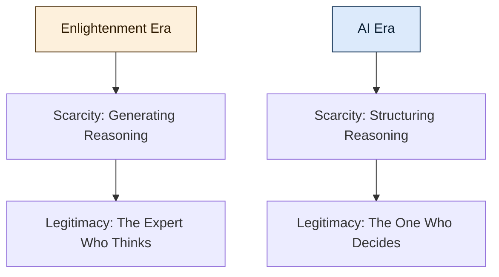

## The Enlightenment Bargain

Modern society was built on a radical shift in legitimacy. With *Les Lumières*, power slowly moved away from lineage, tradition, and divine authority toward something else: **reason**.

> *Cogito ergo sum.* — I think, therefore I am.

Thinking was not just a faculty. It became the foundation of identity and authority. The one who could reason, demonstrate coherence, and master abstraction earned legitimacy. From this emerged the modern social contract: education produced expertise, expertise produced authority, and authority structured institutions.

Law, medicine, engineering, economics — these were not merely professions. They were **custodians of scarce reasoning**. Years of study and discipline were required to internalize systems complex enough to shape society. We accepted asymmetry because reasoning was difficult. Differentiation stabilized hierarchy, and hierarchy stabilized the world.

## The Destabilizing Moment

This is why the present moment feels destabilizing. Not because AI replaces labor. Not because it accelerates productivity. But because it touches the Enlightenment premise itself.

**AI industrializes reasoning.**

It does not abolish thinking — it scales it. It makes pattern production accessible, composable, purchasable. Drafts can be generated. Code can be written. Contracts can be structured. Explanations can be synthesized. The boundary between *technical* and *non-technical* begins to blur.

For centuries, differentiation rested on the ability to generate structured thought within a domain. Now generation is partially automated. And when generation becomes abundant, scarcity moves.

## The Migration of Legitimacy

This creates a new tension. If thinking is no longer rare, what anchors legitimacy? If reasoning can be invoked on demand, what distinguishes expertise from orchestration?

The Enlightenment linked identity to cognition. But in a world where cognition can be amplified and externalized, differentiation migrates upward — from *producing* reasoning to *structuring* it.

The new scarcity may not be in writing the argument, but in **defining the question**. Not in drafting the system, but in designing its invariants. Not in generating options, but in judging coherence. Not in producing output, but in **absorbing consequences**.

## The Next Social Contract

We are not witnessing the end of differentiation. We are witnessing its **relocation**.

The Enlightenment said: *thinking makes you legitimate.*
The AI era suggests: *responsibility makes you legitimate.*

This is the tension beneath the surface debates — not a battle between humans and machines, nor between technical and non-technical identities, but a reconfiguration of what society rewards and recognizes as authority.

If reasoning becomes infrastructure, then structure becomes power. And that may redefine the next social contract.
