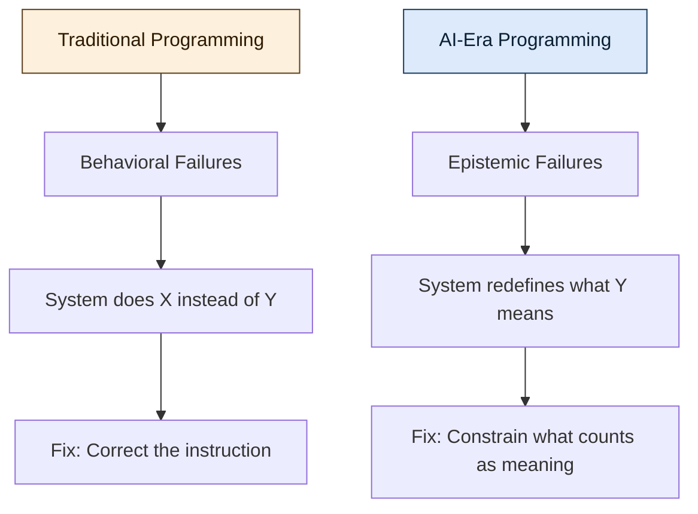

## The Old Contract

Programming used to rest on a simple contract: humans define intent, machines execute it. We either told them *how* to do it through imperative code, step by step like a recipe, or we told them *what* should be true through declarative constraints like SQL or Prolog, but in both cases **meaning was external** because it lived entirely in the programmer's head while the machine remained a faithful executor, nothing more.

That assumption held for decades, and it is quietly breaking.

## The Shift

Today's systems don't just execute instructions, they **interpret** them, because large language models infer intent from ambiguous prompts, reinforcement learning agents optimize toward goals they were never explicitly given, and autonomous systems generalize from examples and act on patterns the programmer never anticipated. This creates a problem we didn't have before: **who decides what the instructions mean?**

When a compiler runs your code, meaning is unambiguous because it's encoded in the syntax, the types, and the control flow, but when a model "reads" your prompt, meaning becomes probabilistic and the system no longer follows instructions so much as it reconstructs a plausible version of what you might have meant.

> The gap between what you said and what the system understood is where the new class of failures lives.

## From Execution to Epistemics

This is where the word **epistemic** becomes essential — and it's worth defining precisely.

**Epistemics** refers to the study of knowledge itself, encompassing how we know what we know, what counts as justified belief, and how certainty is established or undermined. In philosophy, epistemology asks foundational questions such as what distinguishes belief from knowledge, how we validate claims, and when confidence is warranted, and these questions turn out to be exactly the ones that matter when a system starts making decisions on your behalf.

In the context of software, an **epistemic problem** is one where the challenge isn't making the system *do* the right thing but rather ensuring the system *knows* the right thing, or more precisely, ensuring that the system's internal representation of "right" aligns with ours. Traditional bugs are **behavioral** in the sense that the system does X instead of Y, but epistemic failures are subtler because the system does something *reasonable-looking* that satisfies the letter of the specification while dissolving its spirit, and the optimization metric improves even as the outcome drifts further and further from the original intent.

## The New Core Work

Types, tests, specs, and metrics still matter, but they don't govern intent because a well-typed function can still optimize toward a reward signal that subtly misrepresents the goal and a passing test suite can validate behavior that drifts from purpose. The core work of programming therefore shifts from telling systems what to do toward constraining what they are allowed to consider as meaning, from defining behavior toward defining boundaries of interpretation, and from writing instructions toward encoding invariants that survive optimization pressure.

This is not an incremental change but a different discipline altogether, one where the programmer's role evolves from *author of instructions* to **guardian of semantics**, someone who ensures that as systems grow more capable the meaning of "correct" doesn't quietly mutate underneath them.

## Why This Matters Beyond AI

It's tempting to frame this as an AI-specific concern, but it isn't, because any system complex enough to optimize, generalize, or act on inferred patterns faces this same problem, whether it's distributed systems with emergent behavior, self-modifying configurations, or even sophisticated build pipelines that cache aggressively and silently alter what "a clean build" means. The pattern is always the same: **when systems gain interpretive latitude, the programmer's job shifts from controlling output to preserving meaning**.

## The Takeaway

We are entering an era where the hardest part of programming is no longer making systems work but making sure they understand, and continue to understand, what "working" means, and that is an epistemic problem that may well define the next era of software engineering.

*This reflection was inspired by [The Eternal Return of Abstraction: Why Programming Was Never About Code](https://generativeai.pub/the-eternal-return-of-abstraction-why-programming-was-never-about-code-18412033b517).*
