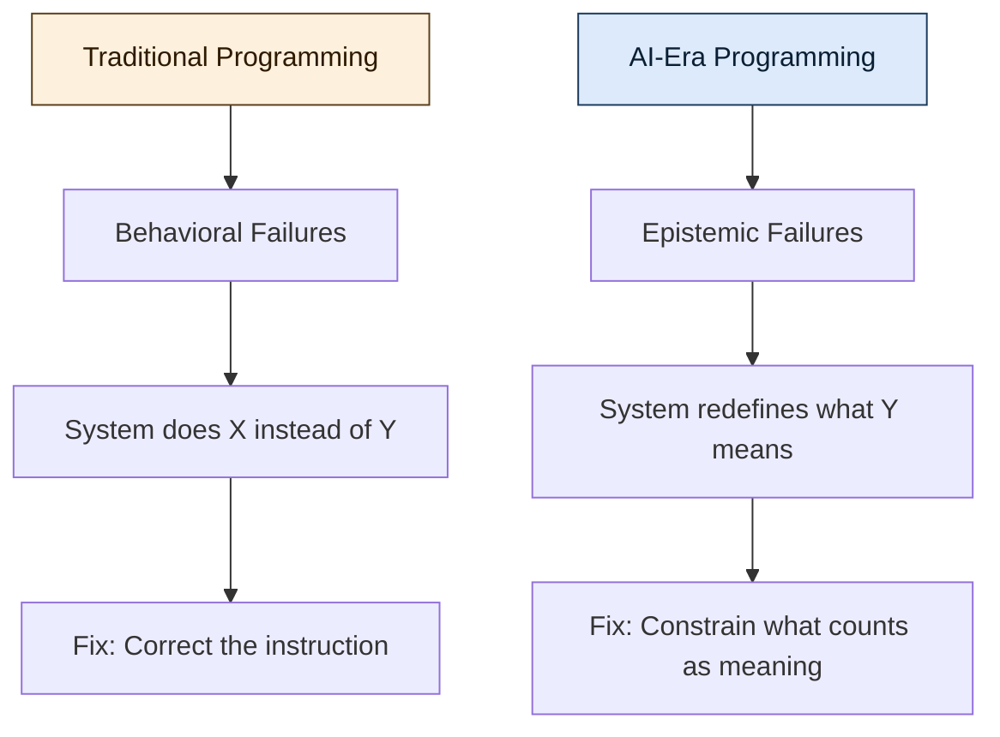

## The Old Contract

Programming used to rest on a simple contract: humans define intent, machines execute it.

We either told them *how* to do it — imperative code, step by step, like a recipe — or *what* should be true — declarative constraints, like SQL or Prolog. In both cases, **meaning was external**. It lived in the programmer's head. The machine was a faithful executor, nothing more.

That assumption held for decades. It is quietly breaking.

## The Shift

Today's systems don't just execute instructions — they **interpret** them. Large language models infer intent from ambiguous prompts. Reinforcement learning agents optimize toward goals they were never explicitly given. Autonomous systems generalize from examples and act on patterns the programmer never anticipated.

This creates a problem we didn't have before: **who decides what the instructions mean?**

When a compiler runs your code, meaning is unambiguous — it's encoded in the syntax, the types, the control flow. But when a model "reads" your prompt, meaning becomes probabilistic. The system doesn't follow instructions; it reconstructs a plausible version of what you might have meant.

> The gap between what you said and what the system understood is where the new class of failures lives.

## From Execution to Epistemics

This is where the word **epistemic** becomes essential — and it's worth defining precisely.

**Epistemics** refers to the study of knowledge itself: how we know what we know, what counts as justified belief, and how certainty is established or undermined. In philosophy, epistemology asks foundational questions — *What is the difference between belief and knowledge? How do we validate claims? When is confidence warranted?*

In the context of software, an **epistemic problem** is one where the challenge isn't making the system *do* the right thing — it's ensuring the system *knows* the right thing. Or more precisely: ensuring the system's internal representation of "right" aligns with ours.

Traditional bugs are **behavioral** — the system does X instead of Y. Epistemic failures are subtler. The system does something *reasonable-looking* that satisfies the letter of the specification while dissolving its spirit. The optimization metric improves, but the outcome drifts from the original intent.

## The New Core Work

Types, tests, specs, and metrics still matter — but they don't govern intent. A well-typed function can still optimize toward a reward signal that subtly misrepresents the goal. A passing test suite can validate behavior that drifts from purpose.

So the core work of programming shifts:

- From **telling systems what to do** → to **constraining what they are allowed to consider as meaning**
- From **defining behavior** → to **defining boundaries of interpretation**
- From **writing instructions** → to **encoding invariants that survive optimization pressure**

This is not an incremental change. It's a different discipline. The programmer's role evolves from *author of instructions* to **guardian of semantics** — someone who ensures that as systems grow more capable, the meaning of "correct" doesn't quietly mutate.

## Why This Matters Beyond AI

It's tempting to frame this as an AI-specific concern. It isn't.

Any system complex enough to optimize, generalize, or act on inferred patterns faces this problem. Distributed systems with emergent behavior. Self-modifying configurations. Even sophisticated build pipelines that cache aggressively and silently alter what "a clean build" means.

The pattern is the same: **when systems gain interpretive latitude, the programmer's job shifts from controlling output to preserving meaning**.

## The Takeaway

We are entering an era where the hardest part of programming is no longer making systems work. It's making sure they understand — and continue to understand — what "working" means.

That's an epistemic problem. And it may define the next era of software engineering.

---

*This reflection was inspired by [The Eternal Return of Abstraction: Why Programming Was Never About Code](https://generativeai.pub/the-eternal-return-of-abstraction-why-programming-was-never-about-code-18412033b517).*
