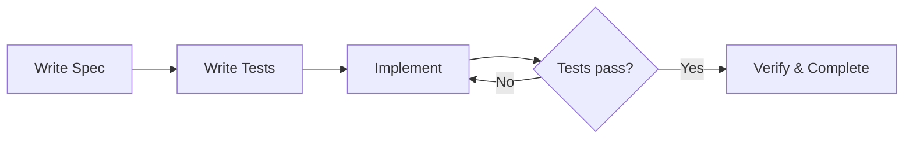
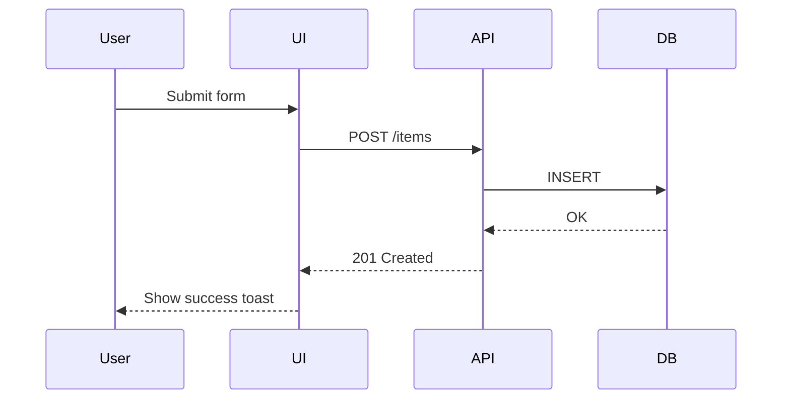
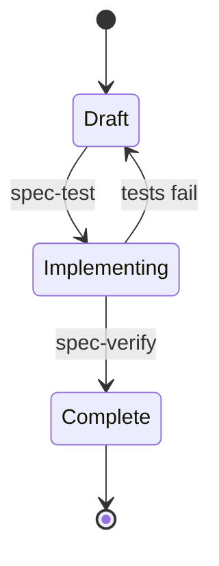

## Flowchart

```mermaid
flowchart LR
  A[Write Spec] --> B[Write Tests]
  B --> C[Implement]
  C --> D{Tests pass?}
  D -- Yes --> E[Verify & Complete]
  D -- No --> C
```

## Sequence Diagram

```mermaid
sequenceDiagram
  participant User
  participant UI
  participant API
  participant DB

  User->>UI: Submit form
  UI->>API: POST /items
  API->>DB: INSERT
  DB-->>API: OK
  API-->>UI: 201 Created
  UI-->>User: Show success toast
```

## State Diagram

```mermaid
stateDiagram-v2
  [*] --> Draft
  Draft --> Implementing : spec-test
  Implementing --> Complete : spec-verify
  Complete --> [*]
  Implementing --> Draft : tests fail
```

## Error state

Invalid syntax renders an error card instead of breaking the page:

```mermaid
unknownDiagramType
  A --> B
```
