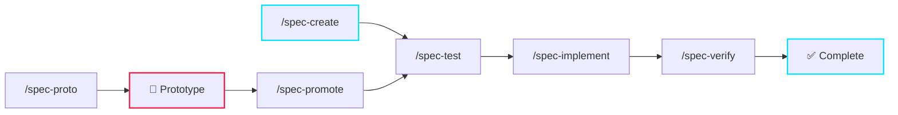

Most developer portfolios are static pages with a list of links. Mine writes its own blog posts.

This is the story of how I built [iraguha.dev](https://iraguha.dev) — a personal site that's equal parts portfolio, content engine, and engineering playground. It's spec-driven, AI-augmented, thoroughly tested, and designed so you can fork it, point Claude at it, and make it yours in an afternoon.

## The Problem With Side Projects

Every developer has the same abandoned side project: the personal website. You spin up a template, write two posts, get distracted by the CSS, and never touch it again. Six months later it's running an outdated version of Next.js and your "latest" post is from 2024.

I wanted something different. Not just a site — a **system**. One that makes publishing frictionless, keeps the codebase disciplined, and gets better every time I add a feature.

The answer turned out to be treating my portfolio like production software.

## Spec-Driven Development: The Backbone

Every feature on this site started as a numbered spec in the `specs/` directory. Not a Jira ticket. Not a sticky note. A real document with acceptance criteria, test plans, and implementation notes.

```
specs/
  001-Portfolio.md          ✅ complete
  002-Resume_Download.md    ✅ complete
  003-mermaid.md            ✅ complete
  004-short.md              ✅ complete
  005-trending-tags.md      ✅ complete
  006-revealjs-talks.md     ✅ complete
  007-post-search.md        ✅ complete
  ...
  014-meta-tags-og.md       ✅ complete
```

The workflow is strict: **spec → failing tests → implementation → verification**. No code without a spec. No implementation without failing tests. Completed specs are immutable — you don't go back and edit history.



There's also a **prototype mode** for when you just want to explore an idea without the ceremony. Write code freely, skip the tests — but the deal is clear: prototype code either gets promoted (tested, verified) or deleted. It never stays as-is in production.

14 specs. 12 complete. 80+ tests. Zero regressions.

## The Stack: Opinionated and Lightweight

No Next.js. No database. No CMS. The stack is deliberately minimal:

- **Bun** as runtime (fast, batteries-included)
- **React 19 + Vite 6** for the UI
- **Vike** for server-side rendering and file-based routing
- **Tailwind CSS 4** for styling
- **Zod** as the single source of truth for data shapes
- **Markdown files** as the content layer

Everything is a `.md` file with YAML frontmatter. Posts, projects, talks, quick notes — all just Markdown, validated by Zod at the boundary, Git-tracked alongside the code. No vendor lock-in. No API keys required to write a blog post.

> The best CMS is `vim` and `git push`.

## Features That Make It Worth Using

### Multi-Category Content

Four content types, one unified grid:

| Category | Purpose | Example |
|----------|---------|---------|
| **Blog** | Long-form articles, deep dives | This post |
| **Project** | Writeups of tools and systems | Portfolio architecture |
| **Talk** | Reveal.js slide decks | Conference presentations |
| **Short** | Quick TILs and hot takes | "Bun's test runner is underrated" |

Each has its own card style, routing rules, and frontmatter schema. Shorts get a ⚡ badge and no cover image. Talks get a ▶ button and a full-viewport presentation mode. Everything shares the same tag system and search index.

### AI-Generated Cover Images

Every blog and project post gets a unique cover image — generated by **Gemini 3 Pro** using a cyberpunk HUD aesthetic I defined in a single `da.md` file (Design Aesthetic).

You control the output with frontmatter:

```yaml
coverKeywords: ["zero-trust", "agent-architecture"]
coverHint: "A HUD showing trust boundaries and memory compartments"
coverText: minimal    # none | minimal | moderate | heavy
```

One command generates covers for all posts that need them:

```bash
bun run covers
```

The system caches by prompt hash, rate-limits API calls, and tracks everything in a manifest. No re-generation unless the prompt changes.

### Reveal.js Talks

Write your slides in Markdown. Separate them with `---`. Add speaker notes with `Note:`. Get a full presentation with code highlighting, Mermaid diagrams, and theme support — all from a single `.md` file.

```markdown
---
title: "My Conference Talk"
category: talk
event: "DevConf 2026"
eventDate: 2026-06-15
---

## Slide One

The key insight is...

---

## Slide Two

'''python
def proof():
    return "it works"
'''

Note: Demo the live version here
```

The talk gets a landing page at `/posts/my-talk` with metadata and links, and a full-screen presentation at `/talks/my-talk`.

### Fuzzy Search

Client-side search powered by **Fuse.js**. Hit `/` to open the search bar, type to filter across titles, summaries, and tags. Debounced, category-aware, with result counts and empty states.

### Trending Tags

Tags are ranked algorithmically: 40% frequency, 60% recency with exponential decay (~69-day half-life). The top 5 appear as colored chips. It's a small feature, but it makes the site feel alive — the trending section shifts as you publish new content.

### SEO That Actually Works

Full SSR via Vike means real HTML on first load. Every page gets:

- Open Graph and Twitter Card meta tags
- JSON-LD structured data (`Article` for posts, `Person` for home)
- Generated `sitemap.xml` and `robots.txt`
- Lighthouse CI checks: SEO ≥ 90, Accessibility ≥ 90

OG images are category-aware: blog posts use the AI-generated cover, shorts get a text card with the ⚡ badge, talks get a cover with a ▶ overlay.

## The Claude Skill: Posts That Write Themselves

Here's where it gets interesting. The site includes a **Claude Code skill** (`.claude/commands/post-creator.md`) that transforms raw notes into publish-ready Markdown.

You type something like:

```
/post-creator hey so I discovered that bun's test runner is actually good,
you don't need jest anymore, watch mode is fast and it reads .env automatically
```

And you get back a polished short with correct frontmatter, code blocks, and structure. The skill handles all four content types, suggests Mermaid diagrams when it detects flows, and auto-splits talk content into slides.

It's prototype code right now (spec 012), but it already works. The skill that wrote this post is the same one you'd use after forking.

## Fork It. Make It Yours.

This entire project is open source and designed to be adapted:

```bash
git clone https://github.com/jiraguha/my-personal-website.git
cd my-personal-website
bun install
bun run dev
```

Here's what you'd change:

1. **`src/content/profile.json`** — your name, role, bio, socials, favicon letter
2. **`da.md`** — your visual aesthetic for AI covers (or delete it and use static images)
3. **`src/content/posts/`** — delete my posts, add yours
4. **`CLAUDE.md`** — the project instructions are already there. Claude knows how to work with this codebase

The SDD workflow, the Claude skills, the cover generation pipeline, the testing infrastructure — it all comes with the repo. You're not forking a template. You're forking a **development system**.

Point Claude at the `CLAUDE.md`, run `/spec-create`, and start building features for your own brand.

## Decisions I'd Make Again

**Markdown over a CMS.** No API calls to fetch your own content. No dashboard to log into. Just files in a folder, version-controlled with your code.

**Zod as the contract.** One schema definition validates frontmatter on load, types the UI components, and catches errors at build time. No type drift between data and display.

**Vike over Next.js.** Lighter, more explicit, no magic. File-based routing without the framework lock-in. SSR where it matters, static export where it doesn't.

**Tests before code.** Not dogma — discipline. Every spec's tests caught at least one assumption I would have shipped without them. The trending tag decay formula? Found a timezone bug in the test phase. Mermaid rendering? Found a race condition. The tests paid for themselves before the features were done.

**Prototype mode.** Not every idea deserves the full ceremony. But every idea that ships deserves tests. The two-track system keeps exploration fast without letting unverified code rot in production.

## What's Next

The site keeps growing spec by spec. Upcoming ideas:

- **RSS feed** for subscribers
- **Reading time estimates** on post cards
- **Comment system** (probably GitHub Discussions-backed)
- **Multi-language support** for broader reach

Each one will be a numbered spec, with tests, with verification. The system scales because the process scales.

## Takeaway

Your portfolio doesn't have to be a weekend project you abandon. It can be a system that reflects how you actually build software — disciplined, tested, and continuously improving.

If you're tired of static templates and want a site that's as engineered as the systems you build at work, [fork the repo](https://github.com/jiraguha/my-personal-website.git) and make it yours. The specs are there. The tests are there. Claude knows the codebase. Start building.

> The best portfolio isn't the one with the fanciest design — it's the one you actually maintain.
