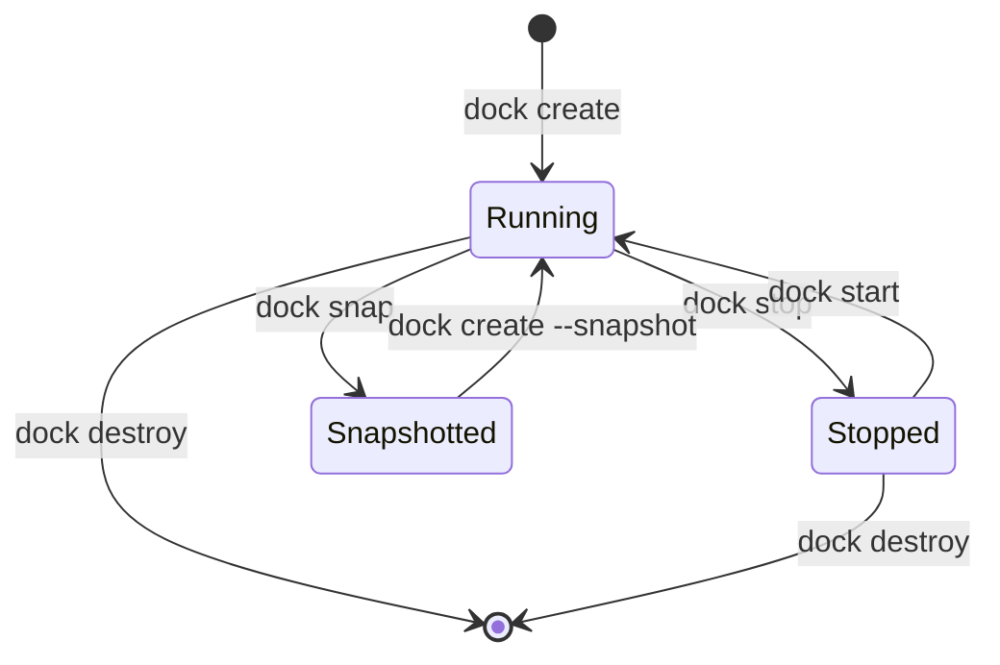
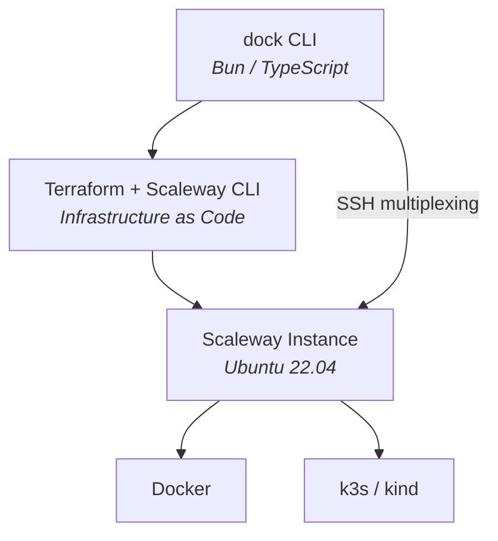

Most development workflows assume that the machine running your code is powerful enough to handle it. In practice, that assumption breaks down quickly. Docker and Kubernetes consume significant CPU and memory. ML workloads demand GPUs that laptops don't carry. Builds on aging hardware become the bottleneck that slows everything else down. I kept running into the same constraint: the compute I needed exceeded what my laptop could provide.

The frustration was specific. I would start a Docker Compose stack with a few services — a database, a message queue, a couple of microservices — and within minutes the fans would spin up, the battery would start draining, and the machine would become sluggish for everything else. Switching to an ML task meant closing everything, because there was no GPU to begin with. The tools were fine. The hardware was the limitation.

**dock** started as a solution to that problem. It is a CLI that provisions disposable remote development environments on Scaleway cloud infrastructure, connects them to your terminal over SSH, and makes the remote machine feel local. You type commands in your terminal the same way you always do — except the compute is happening on a cloud instance with more cores, more memory, and (when you need it) a GPU.

The tradeoff of moving compute off-device was worth it. The laptop stays cool, the battery stays full, and the cost drops to zero the moment the machine is destroyed.

## At a high level

Let's walk through what dock actually does before getting into the details.

At its core, dock manages the full lifecycle of a remote development environment — creation, connection, checkpointing, and teardown — through a small set of CLI commands. The idea is that you should be able to go from "I need a powerful machine" to "I'm working on one" in about five minutes, and from "I'm done for the day" to "paying nothing" in a few seconds.

Here is how local development compares to working through dock:

| | Local Dev | dock |
|---|:---:|:---:|
| CPU usage | High | Zero |
| Battery drain | Yes | No |
| Fan noise | Loud | Silent |
| Cost when idle | N/A | $0 |
| Reproducible | Maybe | Always |

The "reproducible" row is worth pausing on. Because dock environments are created from scratch (or restored from snapshots), you never end up in a situation where "it works on my machine" is the answer. Every environment starts clean, and every snapshot captures the full state.

### Prerequisites

Before installing dock, you need a few tools on your local machine:

- [Terraform](https://terraform.io/) CLI — dock uses Terraform as its infrastructure-as-code layer to provision and manage Scaleway instances
- [Scaleway CLI](https://github.com/scaleway/scaleway-cli) (`scw`) — for API interactions with the cloud provider
- A Scaleway account with API credentials (`SCW_ACCESS_KEY`, `SCW_SECRET_KEY`, `SCW_PROJECT_ID`)
- An SSH key pair (`~/.ssh/id_ed25519` or `~/.ssh/id_rsa`) — dock uses this for all communication with the remote machine

These are the only local dependencies. Docker, Kubernetes, and everything else run on the remote instance — not on your laptop.

### Getting started

Once the prerequisites are in place, the setup takes about three commands. You install dock, configure your credentials, and create your first environment:

```bash
# Install dock
curl -fsSL https://raw.githubusercontent.com/jiraguha/dock/main/install.sh | bash

# Configure your Scaleway credentials
dock env --set SCW_ACCESS_KEY=SCWXXXXXXXXX,SCW_SECRET_KEY=xxx-xxx-xxx,SCW_PROJECT_ID=xxx-xxx-xxx

# Create your first environment
dock create

# You're in. Docker and Kubernetes just work.
dock ssh
docker ps
kubectl get nodes
```

You can also store credentials in `~/.dock/.env` if you prefer not to pass them through the CLI. After `dock create` finishes, you have a remote machine with Docker and k3s pre-installed. Auto-pilot mode — which I will explain in a moment — handles SSH multiplexing, port forwarding, and environment variables automatically.

## The environment lifecycle

The mental model is simple: an environment has three possible states (running, stopped, destroyed), and a handful of commands move it between them.



Let's walk through the core commands:

1. **`dock create`** — provisions a remote machine on Scaleway. This includes Terraform initialization, instance boot, cloud-init setup (Docker + k3s), and SSH connection establishment.
2. **`dock start`** — powers on a previously stopped environment and reconnects all services.
3. **`dock stop`** — gracefully shuts down the instance. The disk is preserved, so you pay only for storage (~€1.60/month), not compute.
4. **`dock reboot`** — restarts the running environment without tearing it down.
5. **`dock snap`** — persists the entire environment state — disk, containers, packages, everything — as a checkpoint. Think of it as a save point you can always return to.
6. **`dock destroy`** — tears down all resources. Cost drops to zero. Use `--yes` or `-y` to skip the confirmation prompt.

In practice, `dock status` surfaces the information that matters at a glance:

```
dock ⛴  Environment Status
─────────────────────────────────────
  State:       🟢 running
  Instance:    DEV1-M
  Zone:        fr-par-1
  IP:          163.172.189.201
  Uptime:      2h 34m
  Branch:      root/main
─────────────────────────────────────
  Docker:      ✓ connected
  Kubernetes:  ✓ k3s (6 pods)
  SSH:         ✓ master active
  Ports:       3000, 8080, 5432
─────────────────────────────────────
```

Everything you need to know — what is running, where it is running, and what is connected — in one view.

## Under the hood: auto-pilot

One of the first things I learned building dock is that provisioning a remote machine is the easy part. The hard part is making it feel local. Without careful setup, you end up juggling SSH connections, manually forwarding ports, re-exporting environment variables every time you open a new terminal tab, and configuring Docker and kubectl to point at the remote machine. That friction is why most developers give up on remote dev after a day.

Auto-pilot exists to eliminate that friction. After `dock create` or `dock start`, it automatically configures your local environment to talk to the remote machine:

| Command | Auto-pilot actions |
|---------|-------------------|
| **`dock create`** | Full setup — SSH multiplexing, port forwarding, Docker environment, Kubernetes config |
| **`dock start`** | Reconnects all services |
| **`dock stop`** | Cleans up connections |
| **`dock destroy`** | Cleans up connections |

In practice, what this means for each layer:

| Action | What it does | Manual equivalent |
|--------|-------------|-------------------|
| **SSH multiplexing** | Establishes a persistent master connection — no reconnect delays between commands. When you open a second terminal tab, it reuses the existing connection instantly. | `dock ssh-config --start-master` |
| **Port forwarding** | Opens background tunnels for common development ports (`8080`, `3000`, `5432`, `6379`, `27017`). If your app listens on port 3000 remotely, `localhost:3000` works locally. | `dock portforward -d` |
| **Docker environment** | Sets `DOCKER_HOST` so that `docker ps`, `docker build`, and every other Docker command you run locally executes against the remote daemon — transparently. | `export DOCKER_HOST=ssh://root@<ip>` |
| **Kubernetes config** | Writes `~/.kube/dock-config` so `kubectl` targets the remote k3s cluster without any manual kubeconfig editing. | `export KUBECONFIG=~/.kube/dock-config` |

Run `dock init` once to add shell integration. After that, environment variables are set automatically whenever dock is running — even across new terminal sessions. You can also run `dock autocomplete` to set up tab completion for all commands.

The tradeoff of auto-pilot is that it assumes conventions about which ports to forward and where to write config files. The default forwarded ports are `8080`, `3000`, `5432`, `6379`, and `27017` — configurable via the `FORWARD_PORTS` environment variable. If your setup diverges from those defaults, you can disable auto-pilot entirely with `dock env --set AUTO_PILOT=false` and manage connections manually. Most users never need to.

## Snapshots and branching

This is where dock introduces a capability that local development cannot replicate. If you have ever wished you could "save your game" before trying something risky — upgrading a major dependency, restructuring a database, testing a new Kubernetes config — snapshots give you exactly that.

Snapshots persist the full disk state: installed packages, Docker images, running containers, configuration files, everything. And they support branching.

```bash
dock snap                        # Checkpoint current state
dock snap --branch feature-x     # Fork into a new branch
dock create --snapshot           # Pick and restore a snapshot interactively
dock snap --tree                 # Visualize the full branch + snapshot tree
dock snap --tree root/main       # Scope to a branch and its descendants
dock snap --list                 # List all branches with snapshot history
dock snap --current              # Print the active branch path
```

Let's walk through a concrete scenario. Say you are running a stable environment with a Postgres database, a few services, and some test data loaded. You want to test a migration that rewrites a core table. Without snapshots, you either risk the environment or spend 30 minutes rebuilding from scratch if things go wrong.

With dock, you run `dock snap` before the migration. If the migration breaks something, you destroy the environment and run `dock create --snapshot` to restore the exact pre-migration state — packages, containers, data, everything.

Branching takes this further. `dock snap --branch feature-x` forks the snapshot into an independent line, so you can run experiments in parallel without affecting the main environment. In practice, this makes experimentation nearly free.

## Scaling across instance types

Not every task needs the same amount of hardware. A quick bug fix might run fine on 2 vCPUs and 2 GB of RAM, while training a model requires a GPU and 48 GB of memory. dock supports several instance types on Scaleway, and switching between them is straightforward:

| Type | vCPU | RAM | Best for |
|------|------|-----|----------|
| `DEV1-S` | 2 | 2 GB | Light development — small services, scripts, config work |
| `DEV1-M` | 3 | 4 GB | Standard development (default) — most web and backend work |
| `DEV1-L` | 4 | 8 GB | Heavy workloads — large builds, multiple services |
| `DEV1-XL` | 4 | 12 GB | Large projects — monorepos, data processing |
| `L4-1-24G` | 8 | 48 GB | GPU / ML workloads — model training, inference |

Switching types is a snapshot-destroy-recreate cycle. The environment state is preserved — only the underlying hardware changes:

```bash
dock snap
dock destroy
dock env --set SCW_INSTANCE_TYPE=L4-1-24G
dock create --snapshot    # Same environment, now GPU-powered
```

This means you can develop on a cheap instance all week, and when you need to run a GPU-intensive job on Friday, you scale up for a few hours and scale back down. You pay for the bigger machine only while it is running.

## Docker and Kubernetes integration

Both container runtimes run on the remote instance and are accessed over SSH. You do not need Docker Desktop or a local Kubernetes distribution — only the local prerequisites (Terraform, Scaleway CLI, SSH) are required on your machine. Docker, k3s, and all their dependencies are provisioned on the remote instance during `dock create`.

**Docker** supports two modes, depending on how much container work you are doing:

```bash
# Simple mode (each command executes over SSH — good for occasional use)
eval $(dock docker-env)
docker ps

# Tunnel mode (persistent socket, lower latency — better for heavy use)
dock docker-tunnel -d
export DOCKER_HOST=unix://~/.dock/sockets/docker.sock
```

Simple mode sends each Docker command individually over SSH. It works well for occasional `docker ps` or `docker logs` calls. Tunnel mode opens a persistent socket connection that routes all Docker traffic through a local Unix socket — significantly faster if you are running builds, pulling images, or managing many containers.

**Kubernetes** uses k3s by default (a lightweight, production-ready distribution) or kind if you prefer — configurable via `K8S_ENGINE`:

```bash
dock kubeconfig
export KUBECONFIG=~/.kube/dock-config
kubectl get nodes
```

Both are configured automatically when auto-pilot is enabled. In practice, the experience is close to running containers locally. The SSH layer is transparent — you interact with Docker and kubectl the same way you always have, and the commands execute on the remote machine.

## Connection management and diagnostics

dock provides a few utilities for inspecting and managing the connection to the remote machine:

```bash
dock connection              # Show connection status
dock connection --refresh    # Restart all connections
dock connection --clean      # Stop all connections
dock configure               # Apply SSH server settings to remote
dock configure --show        # Show remote SSH config
dock analytics               # Show usage summary
dock analytics --last        # Show last 10 operations
```

These are useful when troubleshooting — for example, if SSH connections start dropping, `dock configure` can apply tuned SSH server settings (`SSH_MAX_STARTUPS`, `SSH_MAX_SESSIONS`) to the remote instance. `dock analytics` tracks how you use dock over time, which can help identify usage patterns.

## Environment configuration

Beyond the core credentials, dock exposes a number of configuration options through `dock env`:

```bash
dock env                     # View current configuration
dock env --set KEY=value     # Set one or more options
dock env --unset KEY         # Remove an option
```

Some commonly adjusted settings:

| Variable | Default | Description |
|----------|---------|-------------|
| `SCW_ZONE` | `fr-par-1` | Scaleway zone (Paris, Amsterdam, Warsaw) |
| `SCW_INSTANCE_TYPE` | `DEV1-M` | Instance type |
| `K8S_ENGINE` | `k3s` | Kubernetes distribution: `k3s` or `kind` |
| `FORWARD_PORTS` | `8080,3000,5432,6379,27017` | Ports to forward |
| `AUTO_PILOT` | `true` | Enable auto-pilot mode |
| `DOCK_NONINTERACTIVE` | `0` | Set to `1` to disable prompts (useful for CI/scripts) |

The full list is in the [README](https://github.com/jiraguha/dock#environment-configuration).

## Cost model

One of the principles behind dock is that you should never pay for compute you are not using. The pricing model reflects this:

| State | Cost |
|-------|------|
| **Running** (DEV1-M) | ~€7.99/month (if running 24/7) |
| **Stopped** (disk only) | ~€1.60/month |
| **Destroyed** | €0.00 |

Stop when you are not working. Destroy when you are done with a project entirely. No subscription, no minimum commitment.

## Tech stack



Under the hood, dock is built on a small number of well-understood tools:

- **Runtime:** Bun (TypeScript) — chosen for fast cold starts and a batteries-included standard library
- **Infrastructure as Code:** Terraform — manages instance provisioning, snapshot lifecycle, and teardown
- **Cloud Provider:** Scaleway — first-class EU support, competitive pricing, and a clean API
- **Kubernetes:** k3s or kind, depending on the use case. k3s is the default because it is lightweight and production-grade.
- **Distribution:** Pre-built binaries for Linux and macOS (x64 + ARM64). A single `curl | bash` installs everything.

The CLI talks to Terraform, Terraform talks to Scaleway, and SSH connects your terminal to the remote machine. Port forwarding and Docker tunneling run as background processes when auto-pilot is enabled, but there is no persistent daemon — everything is tied to the lifetime of the dock environment.

## What has shipped and what comes next

The CLI is functional and covers the core workflow. The project is currently in beta (v0.1.24).

What has shipped:

- [x] Single executable CLI with self-upgrade (`dock upgrade`, with `--track=<branch>` for tracking specific streams)
- [x] Polished CLI UX with spinners, colors, and progress tracking (built on `@clack/prompts` and `picocolors`)

The roadmap reflects the areas where the tool still has meaningful gaps:

- [ ] **Automatic shutdown** — a heartbeat-based kill switch for inactive machines, with auto-destroy after 1 week of inactivity. This is the most requested feature.
- [ ] **File transfer** — `dock send` / `dock fetch` for quick uploads and downloads without needing to `scp` manually
- [ ] **Bidirectional directory sync** — real-time sync between local and remote filesystems, so you can edit files locally and have changes reflected instantly on the remote machine
- [ ] **OpenClaw Safe Mode** — restricting actions to safe, reversible, or sandboxed operations
- [ ] **MCP Integration** — Machine Control Protocol for advanced lifecycle management
- [ ] **Multi-provider support** — extending beyond Scaleway to GCP, AWS, and Azure
- [ ] **Multi-environment management** — running multiple isolated environments (dev, staging, prod) in parallel
- [ ] **Web UI** — browser-based environment management for teams
- [ ] **NixOS integration** — declarative, reproducible environment definitions that go beyond snapshots
- [ ] **Claude Code integration** — AI-assisted development workflow within remote environments

## Summary

dock removes the constraint that ties development capability to local hardware. The cost of a destroyed environment is zero, and the snapshot and branching model makes experimentation cheap in a way that local development cannot match.

The snapshot model is the part I did not expect to use as much as I do. Being able to fork an environment before a risky change — and recover the original state if things go wrong — changes how willing you are to experiment. The cost of trying something drops close to zero, and that shifts how you approach problems.

The project is open source, MIT-licensed, and currently in beta. If you are running into the same hardware constraints that motivated dock, or if you are curious about how disposable environments change a development workflow, the repository is the best place to start.

**GitHub:** [github.com/jiraguha/dock](https://github.com/jiraguha/dock)
