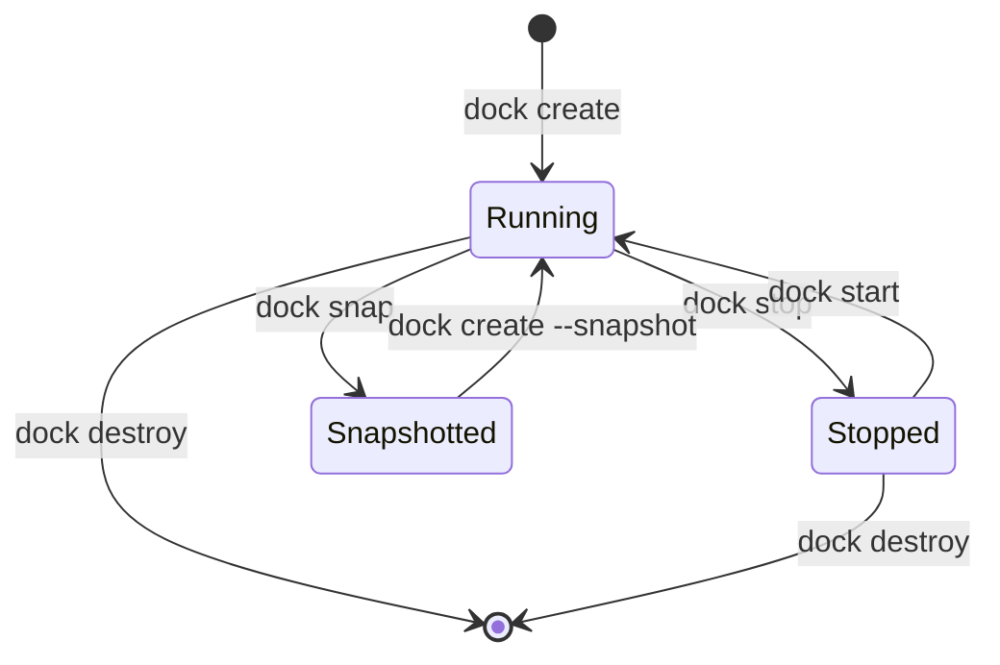
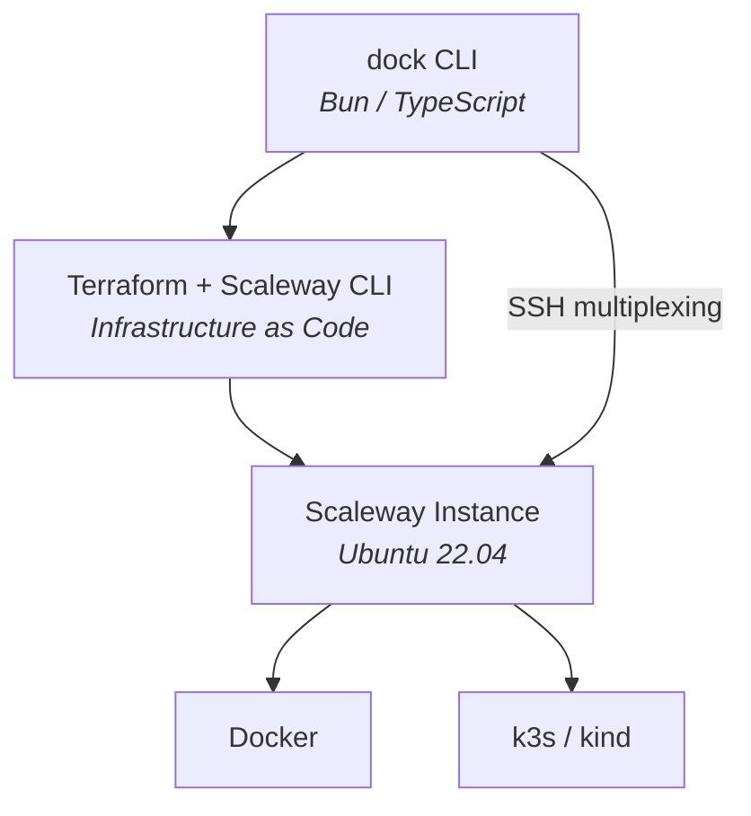

Running Docker and Kubernetes locally drains your battery, spins up fans, and turns your laptop into a space heater. ML models need GPUs you don't have. Builds take forever on aging hardware. I got tired of "my machine can't handle this" being a real excuse — so I built **dock**.

## What dock Does

**dock** is a CLI for disposable remote development environments on cloud infrastructure. It provisions a powerful remote machine, connects it to your terminal over SSH, and makes it feel local. Docker, Kubernetes, port forwarding — everything just works, except the compute is happening somewhere else.

Your laptop stays cool. Your battery stays full. Your wallet only hurts when the machine is running.

| | Local Dev | dock |
|---|:---:|:---:|
| CPU usage | High | Zero |
| Battery drain | Yes | No |
| Fan noise | Loud | Silent |
| Cost when idle | N/A | $0 |
| Reproducible | Maybe | Always |

## Quick Start

```bash
# Install dock
curl -fsSL https://raw.githubusercontent.com/jiraguha/dock/main/install.sh | bash

# Configure your Scaleway credentials
dock env --set SCW_ACCESS_KEY=SCWXXXXXXXXX,SCW_SECRET_KEY=xxx,SCW_PROJECT_ID=xxx

# Create your first environment (~2 minutes)
dock create

# You're in. Docker and Kubernetes just work.
dock ssh
docker ps
kubectl get nodes
```

That's it. Auto-pilot mode handles SSH multiplexing, port forwarding, and environment variables automatically.

## The Lifecycle

Five commands cover the entire workflow:



1. **`dock create`** — provisions a remote machine in ~2 minutes
2. **Work normally** — Docker, Kubernetes, everything runs remotely over SSH
3. **`dock snap`** — checkpoint your entire environment
4. **`dock stop`** — pause and pay only for disk storage
5. **`dock destroy`** — tear it all down, pay zero

Here's what `dock status` looks like in practice:

```
dock ⛴  Environment Status
─────────────────────────────────────
  State:       🟢 running
  Instance:    DEV1-M
  Zone:        fr-par-1
  IP:          163.172.189.201
  Uptime:      2h 34m
  Branch:      root/main
─────────────────────────────────────
  Docker:      ✓ connected
  Kubernetes:  ✓ k3s (6 pods)
  SSH:         ✓ master active
  Ports:       3000, 8080, 5432
─────────────────────────────────────
```

## Auto-Pilot Mode

After `dock create` or `dock start`, auto-pilot automatically sets up everything you need:

| Action | What it does |
|--------|-------------|
| SSH multiplexing | Persistent master connection — no reconnect delays |
| Port forwarding | Background tunnel for `8080`, `3000`, `5432`, `6379`, `27017` |
| Docker environment | Sets `DOCKER_HOST` so local Docker commands hit the remote daemon |
| Kubernetes config | Writes `~/.kube/dock-config` so `kubectl` just works |

Run `dock init` once to add shell integration. After that, environment variables are set automatically whenever dock is running.

Don't want the magic? Disable it with `dock env --set AUTO_PILOT=false` and manage connections manually.

## Snapshots and Branching

This is where dock gets interesting. Snapshots work like git — but for your entire machine.

```bash
dock snap                        # Checkpoint current state
dock snap --branch feature-x     # Fork into a new branch
dock create --snapshot           # Restore from any snapshot
dock snap --tree                 # Visualize the branch tree
```

Snapshots preserve **everything**: installed packages, Docker images, running containers, configuration files, the full disk state. Fork a branch to try a risky experiment. If it doesn't work out, go back to the original snapshot. If it does, keep going.

> Think `git branch` but for your entire development environment — packages, containers, configs, and all.

## Instance Types

Scale up or down depending on the workload:

| Type | vCPU | RAM | Best for |
|------|------|-----|----------|
| `DEV1-S` | 2 | 2 GB | Light development |
| `DEV1-M` | 3 | 4 GB | Standard development (default) |
| `DEV1-L` | 4 | 8 GB | Heavy workloads |
| `DEV1-XL` | 4 | 12 GB | Large projects |
| `L4-1-24G` | 8 | 48 GB | GPU / ML workloads |

Switch types at any time — snapshot your current environment, destroy it, and recreate on a bigger (or smaller) machine:

```bash
dock snap
dock destroy
dock env --set SCW_INSTANCE_TYPE=L4-1-24G
dock create --snapshot    # Same environment, GPU-powered
```

## Docker and Kubernetes

Both work over SSH with zero local installation beyond dock itself.

**Docker** runs in two modes — SSH-per-command for simplicity, or socket tunneling for performance:

```bash
# Simple mode
eval $(dock docker-env)
docker ps

# Tunnel mode (faster for heavy use)
dock docker-tunnel -d
export DOCKER_HOST=unix://~/.dock/sockets/docker.sock
```

**Kubernetes** uses k3s by default (or kind if you prefer):

```bash
dock kubeconfig
export KUBECONFIG=~/.kube/dock-config
kubectl get nodes
```

Both are configured automatically when auto-pilot is enabled.

## Cost

| State | Cost |
|-------|------|
| **Running** (DEV1-M) | ~€7.99/month |
| **Stopped** (disk only) | ~€1.60/month |
| **Destroyed** | €0.00 |

Stop when you're not working. Destroy when you're done. No subscription, no minimum commitment.

## Tech Stack



- **Runtime:** Bun (TypeScript)
- **Infrastructure as Code:** Terraform
- **Cloud Provider:** Scaleway (first-class EU support)
- **Kubernetes:** k3s or kind
- **Distribution:** Pre-built binaries for Linux and macOS (x64 + ARM64)

## Roadmap

What's shipped and what's coming:

- [x] Single executable CLI with self-upgrade (`dock upgrade`)
- [x] Beautiful CLI UX with spinners, colors, and progress tracking
- [ ] **Automatic shutdown** — heartbeat-based kill switch for inactive machines
- [ ] **File transfer** — `dock send` / `dock fetch` for quick uploads and downloads
- [ ] **Bidirectional directory sync** — real-time sync between local and remote
- [ ] **Multi-provider support** — GCP, AWS, Azure
- [ ] **Multi-environment management** — dev, staging, prod in parallel
- [ ] **Web UI** — browser-based environment management
- [ ] **NixOS integration** — declarative, reproducible environments
- [ ] **Claude Code integration** — AI-assisted development workflow

## Takeaway

Your laptop shouldn't be the bottleneck. dock lets you work on anything — heavy Docker stacks, Kubernetes clusters, GPU-hungry ML models — without upgrading your hardware or melting your battery.

Two minutes to create. Thirty seconds to resume. Zero cost when destroyed.

It's open source and MIT-licensed. Try it, break it, contribute.

**GitHub:** [github.com/jiraguha/dock](https://github.com/jiraguha/dock)
