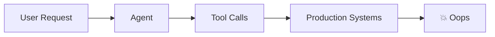
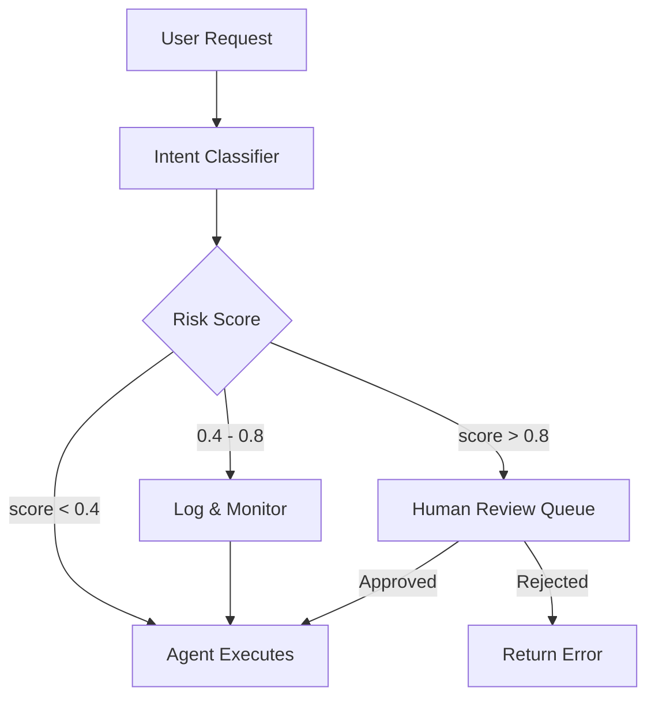

# Securing Agentic Systems
### Guardrails in Production

Jean-Paul Iraguha · KubeCon EU 2026

Note: Welcome everyone. Today we'll talk about how to ship agents safely without slowing down.

---

## The Problem

- Autonomous agents make decisions **without human approval**
- Unconstrained agents can take **destructive actions**
- Traditional RBAC doesn't account for *intent*

> "You don't know what an agent will do until it does it."

Note: Start with the why — why existing security patterns break down for agents.

---

## What We're Building Against



Note: The naive architecture. No guardrails, no visibility.

---

## The Guardrail Stack

```python [1-3|5-9|11-13]
# Step 1: Classify intent
intent = classifier.predict(user_request)

# Step 2: Score risk
risk = scorer.evaluate(
    intent=intent,
    tools_available=agent.tools,
    context=session_context,
)

# Step 3: Gate or proceed
if risk.score > threshold:
    return require_human_approval(intent)
```

Note: Walk through each step. The key insight: check BEFORE the agent acts, not after.

---

## Risk Scoring Model

| Signal | Weight |
|--------|--------|
| Action scope (read vs write vs delete) | 0.3 |
| Data sensitivity | 0.4 |
| Reversibility | 0.3 |

Score = Σ (signal × weight) × context_multiplier

Note: These weights came from incident data. Adjust per your threat model.

----

### Context Multiplier

```typescript
function contextMultiplier(ctx: AgentContext): number {
  if (ctx.environment === "production") return 2.0;
  if (ctx.isFirstRun) return 1.5;
  return 1.0;
}
```

Note: Vertical slide — production context doubles the risk score. First-run gets a penalty too.

---

## Architecture: Human-in-the-Loop



Note: Three tiers. Low risk proceeds automatically. Medium gets logged. High blocks for review.

---

## Benchmarking Before Deploy

```bash
# Run the safety suite against your agent
bun run bench:safety \
  --agent ./dist/my-agent \
  --scenarios ./safety-scenarios/ \
  --threshold 0.95
```

- 47 built-in adversarial scenarios
- Measures containment, reversibility, and scope
- Fails the build if score < threshold

Note: This is the key insight. Benchmark safety like you benchmark performance.

---

## Results from Production

| Metric | Before | After |
|--------|--------|-------|
| Unintended deletions / week | 12 | 0 |
| Human review queue depth | — | ~8/day |
| P99 agent latency | 340ms | 420ms |
| Incident rate | 3.2/month | 0.1/month |

Note: Real numbers from our internal deployment. 80ms overhead is worth it.

---

## Key Takeaways

1. **Guardrails are infrastructure** — not an afterthought
2. **Benchmark before you deploy** — safety suite in CI
3. **Human-in-the-loop** for high-risk decisions, automated for low
4. **Observe everything** — you can't secure what you can't see

---

## Thank You

**Jean-Paul Iraguha**

iraguha.dev · [@jeanpauldev](https://github.com/jpiraguha)

*Slides + code at github.com/jpiraguha/agent-guardrails*

Note: Leave contact up. Happy to chat about specific threat models after.
