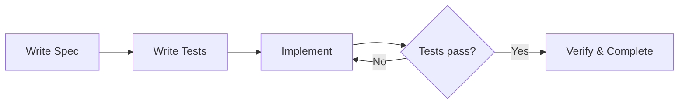
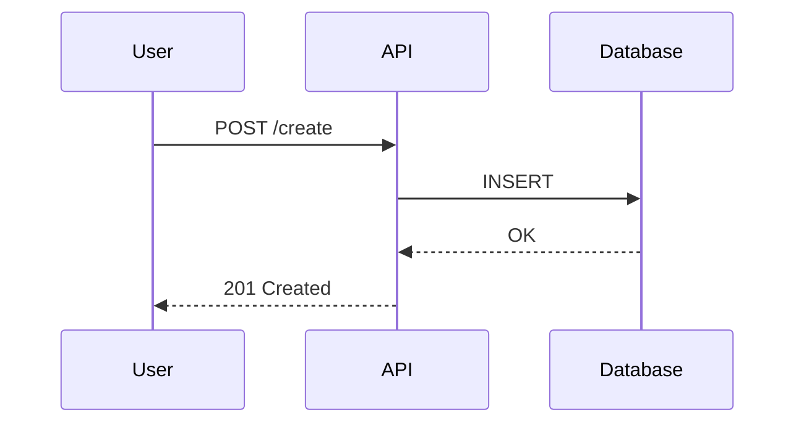

## Flowchart

```mermaid
flowchart LR
  A[Write Spec] --> B[Write Tests]
  B --> C[Implement]
  C --> D{Tests pass?}
  D -- Yes --> E[Verify & Complete]
  D -- No --> C
```

## Sequence Diagram

```mermaid
sequenceDiagram
  participant U as User
  participant A as API
  participant DB as Database
  U->>A: POST /create
  A->>DB: INSERT
  DB-->>A: OK
  A-->>U: 201 Created
```

## Invalid Block (should show error)

```mermaid
this is not valid mermaid syntax!!!
```
